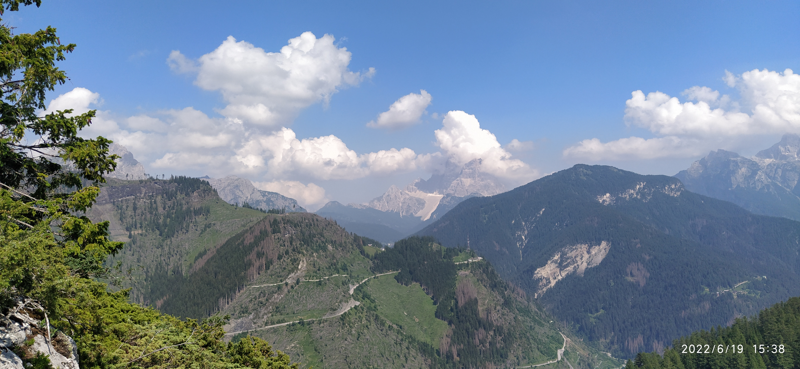
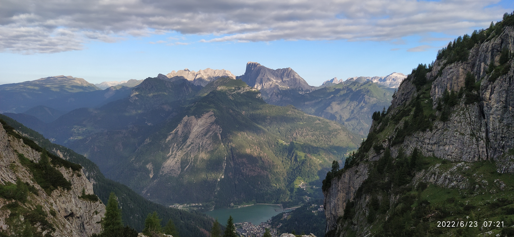

# :flag_it: 2022 - Dolomity II.

{ width="100%" }
*Cortina d'Ampezzo a okolí - červenec 2022*

---

## :calendar: Základní informace

**Termín:** 18. - 25. června 2022  
**Destinace:** Dolomity, Itálie  
**Ubytování:** Alleghe, 32022 Provincie Belluno, Itálie  
**Účastníci:** 30 členů  
**Počasí:** :partly_sunny: Proměnlivé, bouřky (21.6.)

---

## :mountain: Přehled výstupů

| Datum | Výstup | Výška | Obtížnost | Poznámka |
|-------|--------|-------|-----------|----------|
| 19.6. | Via Ferrata Lagazuoi + Sass de Rocia | - | B/C | Tunely + ferrata |
| 20.6. | Marmolada | 3343 m | A/B | Ledovec + ferrata Nordgrat |
| 21.6. | Via Ferrata dei Finanzieri | - | C | Za bouřky! ⚡ |
| 22.6. | Via Ferrata degli Alleghesi Civetta | - | C | Extrémně dlouhá - 18 hodin! |

---

## :hiking_boot: Den po dni

### 📅 Neděle 19.6.2022 - Lagazuoi a Sass de Rocia

**Ferraty:** Via Ferrata Lagazuoi (tunely) + Sass de Rocia (B/C)  
**Obtížnost:** B/C  
**Charakter:** Historické tunely z 1. sv. války + krásná ferrata

{ width="100%" }

**Popis:** Úžasný zážitek! Via Ferrata Lagazuoi vede historickými **tunely z první světové války** vyraženými italskými vojáky. Poté jsme pokračovali na ferratu **Sass de Rocia** s krásnými výhledy na Dolomity.

!!! info "Historický kontext"
    Tunely byly vyraženy italskými vojáky během 1. světové války (1915-1918) jako strategické cesty skrz hory.

#### 🎬 Video z výstupu

**Lagazuoi - Tunely:**
<iframe width="100%" height="450" src="https://www.youtube.com/embed/4noScm3VhBA" title="Lagazuoi" frameborder="0" allow="accelerometer; autoplay; clipboard-write; encrypted-media; gyroscope; picture-in-picture" allowfullscreen></iframe>

**Sass de Rocia:**
<iframe width="100%" height="450" src="https://www.youtube.com/embed/gYlbrXufjoU" title="Sass de Rocia" frameborder="0" allow="accelerometer; autoplay; clipboard-write; encrypted-media; gyroscope; picture-in-picture" allowfullscreen></iframe>

---

### 📅 Pondělí 20.6.2022 - Marmolada - Královna Dolomit

**Výstup:** Marmolada (3343 m)  
**Ferrata:** Marmolada Nordgrat Normalweg (A/B)  
**Obtížnost:** A/B  
**Charakter:** Ledovec + snadná ferrata

{ width="100%" }

**Popis:** Výstup na **Marmoladu** (3343 m) - **nejvyšší horu Dolomit!** 🏔️ Cesta vede přes ledovec po ferratě "Marmolada Nordgrat Normalweg" (A/B). Jednoduchá ferrata, ale nezapomenutelný zážitek dosáhnout nejvyššího bodu Dolomit!

!!! success "Královna Dolomit"
    Marmolada je s výškou 3343 m nejvyšší horou celých Dolomit. Její ledovec je nejjižnějším ledovcem v Alpách.

#### 🎬 Video z výstupu

<iframe width="100%" height="450" src="https://www.youtube.com/embed/1SIFaxhoHJA" title="Marmolada - Královna Dolomit" frameborder="0" allow="accelerometer; autoplay; clipboard-write; encrypted-media; gyroscope; picture-in-picture" allowfullscreen></iframe>

---

### 📅 Úterý 21.6.2022 - Finanzieri za bouřky

**Ferrata:** Via Ferrata dei Finanzieri (C)  
**Obtížnost:** C  
**Podmínky:** ⚡ BOUŘKA! ⚡

{ width="100%" }

**Popis:** Extrémní zážitek! Absolvovali jsme Via Ferrata dei Finanzieri **za bouřky**! ⚡ Blesky, hromy, déšť - adrenalin na maximum. Ferrata je pojmenovaná po italské finanční stráži (Guardia di Finanza), která tyto hory hlídala.

!!! danger "Nebezpečné podmínky"
    Lezení na ferratě za bouřky je **extrémně nebezpečné** kvůli riziku zásahu bleskem! Nedělejte to, pokud to není nezbytně nutné.

#### 🎬 Video z výstupu

<iframe width="100%" height="450" src="https://www.youtube.com/embed/fj82dTwBj3U" title="Finanzieri za bouřky" frameborder="0" allow="accelerometer; autoplay; clipboard-write; encrypted-media; gyroscope; picture-in-picture" allowfullscreen></iframe>

---

### 📅 Středa 22.6.2022 - Alleghesi Civetta - Megamaraton

**Ferrata:** Via Ferrata degli Alleghesi Civetta (C)  
**Obtížnost:** C  
**Čas:** ⏰ **18 HODIN!** ⏰

{ width="100%" }

**Popis:** Nezapomenutelný (a vyčerpávající!) den! Via Ferrata degli Alleghesi na Civettě nám vzala celých **18 hodin výstupu a sestupu**! 🥵 Jedna z nejdelších a nejnáročnějších ferrat v Dolomitách. 

Ferrata je pojmenovaná po obyvatelích města **Alleghe** (kde jsme byli ubytovaní). Civetta (3220 m) je známá svou masivní severozápadní stěnou - jednou z největších stěn v Alpách.

!!! warning "Extrémně dlouhá ferrata"
    Tato ferrata vyžaduje vynikající fyzickou kondici a dobré časové plánování. 18 hodin v horách je extrémně náročné!

#### 🎬 Video z výstupu

<iframe width="100%" height="450" src="https://www.youtube.com/embed/wA_6ULwlEZ4" title="Alleghesi Civetta - Megamaraton" frameborder="0" allow="accelerometer; autoplay; clipboard-write; encrypted-media; gyroscope; picture-in-picture" allowfullscreen></iframe>

---

## :camera: Fotografie z výpravy

**Poznámka:** V sekci "Den po dni" výše najdete fotografie a videa pro každý den výpravy.

---

## :link: Kompletní fotogalerie

!!! success "Online galerie"
    **Google Drive:** [Dolomity 2022 - II. výprava](https://drive.google.com/drive/folders/example2022)  
    *(392 fotografií, 3.8 GB)*
    
    **OneDrive:** [Záložní galerie 2022](https://onedrive.live.com/example2022)

### Náhled galerie

{ width="24%" }
{ width="24%" }
{ width="24%" }
{ width="24%" }

---

## :memo: Zážitky a vzpomínky

!!! quote "Nezapomenutelné momenty"
    Zážitky a vzpomínky členů týmu budou doplněny později.

### Statistiky výpravy

| Kategorie | Hodnota |
|-----------|---------|
| **Účastníci** | 30 členů |
| **Nejvyšší bod** | 3343 m (Marmolada) |
| **Počet výstupů** | 4 |
| **Počet ferrat** | 4 |
| **Celkem nastoupáno** | |
| **Průměrný čas výstupu** | |

---

## :star: Hodnocení

**Celková obtížnost:** :star::star::star::star::star: (5/5)  
**Krása krajiny:** :star::star::star::star::star: (5/5)  
**Technická náročnost:** :star::star::star::star::star: (5/5)  
**Nezapomenutelnost:** :star::star::star::star::star: (5/5)

---

:mountain: <strong>Dolomity II. - Pokořili jsme třítisícovky!</strong> :mountain:

---

## :camera: Fotogalerie

-   
-   
-   
-   
-   
-   
-   
-   

