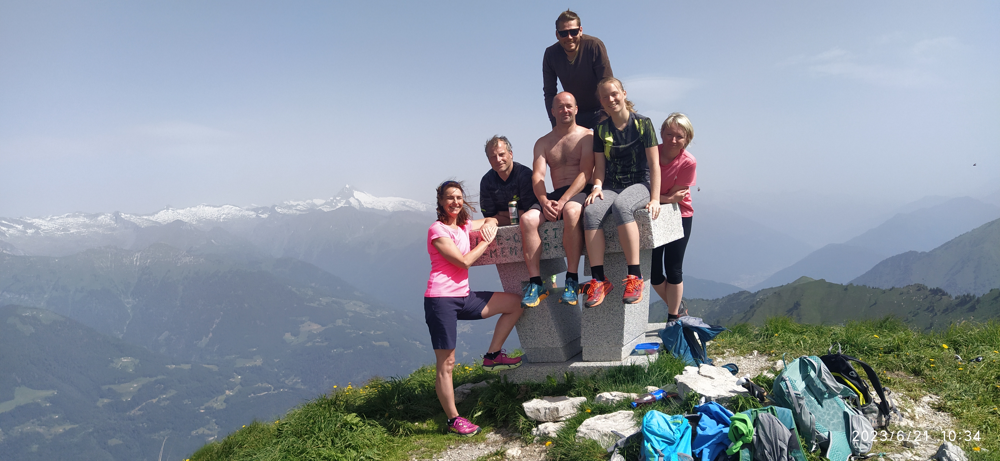

# :flag_it: 2023 - Itálie (Ledro I.)

{ width="100%" }
*První návštěva jezera Ledro - srpen 2023*

---

## :calendar: Základní informace

**Termín:** 17. - 24. června 2023  
**Destinace:** Lago di Ledro, Trentino, Itálie  
**Ubytování:** Residence Alessio, Bezzecca (kousek od jezera Ledro)  
**Účastníci:** 30 členů  
**Počasí:** :sunny: Krásné, slunečné

---

## :mountain: Přehled výstupů

| Datum | Výstup | Výška | Obtížnost | Popis |
|-------|--------|-------|-----------|-------|
| 18.6. | Via Ferrata Fausto Susatti + Mario Foletti | - | B | Biacesa di Ledro → Cima Rocca → Bivacco Arcioni |
| 19.6. | Via Ferrata Rino Pisetta | - | E | Technicky náročná ferrata |
| 20.6. | Monte Cadria + Ferraty | 2254 m | C/D | Výstup + Ferrata Ballino, Cascata Rio Ruzza, Signora delle Acque |
| 21.6. | Casto Klettersteig Park | - | C až F | Lezecký park s různými trasami |
| 22.6. | Via Ferrata Stretta di Luina | - | C | Další trasa v parku Casto |
| 23.6. | Cima Cop di Breguzzo | 3003 m | PD+ | Závěrečný vysoký vrchol |

---

## :hiking_boot: Den po dni

### 📅 Neděle 18.6.2023 - Dvoj-ferrata kolem Ledra

!!! info "Trasa: Biacesa di Ledro → Susatti riva → Cima Capi → Cima Rocca → Bivacco Arcioni → zpět po silnici"
    **Ferraty:**
    
    - **Via Ferrata "Fausto Susatti"** (B) - první úsek
    - **Via Ferrata "Mario Foletti"** (B) - pokračování
    
    **Čas:** Celý den  
    **Obtížnost:** B  

{ width="100%" }

**Popis:** Krásná okružní trasa kolem jezera Ledro s dvěma ferratami. Start z Biacesa di Ledro, přes Susatti riva na vrcholy Cima Capi a Cima Rocca. Nocleh v Bivacco Arcioni, sestup po silnici zpět.

#### 🎬 Video z výstupu

<iframe width="100%" height="450" src="https://www.youtube.com/embed/HQbvMFAYYZo" title="Dvoj-ferrata kolem Ledra" frameborder="0" allow="accelerometer; autoplay; clipboard-write; encrypted-media; gyroscope; picture-in-picture" allowfullscreen></iframe>

---

### 📅 Pondělí 19.6.2023 - Rino Pisetta Challenge

!!! warning "Via Ferrata Rino Pisetta (E) - Technická výzva"
    **Obtížnost:** E (velmi náročná!)  
    **Charakter:** Technicky náročná ferrata s exponovanými pasážemi  

{ width="100%" }

**Popis:** Via Ferrata Rino Pisetta patří mezi nejnáročnější ferraty v oblasti. Vyžaduje dobrou fyzickou kondici a techniku. Exponované pasáže a vertikální stěny.

---

### 📅 Úterý 20.6.2023 - Monte Cadria & Vodospádové ferraty

!!! success "Kombinace vrcholu a ferrat"
    **Monte Cadria:** 2254 m n.m.  
    **Ferraty:**
    
    1. **Ferrata Ballino** (C/D)
    2. **Cascata Rio Ruzza** (C/D) - ferrata u vodospádů
    3. **Ferrata Signora delle Acque** (C/D) - "Paní vod"

{ width="100%" }

{ width="100%" }

**Popis:** Náročný den kombinující vysoký vrchol s následnou trojicí ferrat. Cascata Rio Ruzza vede podél vodospádů a nabízí osvěžení v horkém dni.

#### 🎬 Video z výstupu

<iframe width="100%" height="450" src="https://www.youtube.com/embed/0uQFHaxI-KI" title="Monte Cadria & Vodospádové ferraty" frameborder="0" allow="accelerometer; autoplay; clipboard-write; encrypted-media; gyroscope; picture-in-picture" allowfullscreen></iframe>

---

### 📅 Středa 21.6.2023 - Casto Klettersteig Park

!!! tip "Lezecký park pro každého"
    **Obtížnost:** C až F (různé trasy)  
    **Charakter:** Moderní lezecký park s multiplat trasami  

{ width="100%" }

**Popis:** Casto Klettersteig Park nabízí trasy různých obtížností od C po extrémní F. Každý si může vybrat podle svých schopností. Moderní jistící systémy a skvele zajištěné trasy.

#### 🎬 Video z výstupu

<iframe width="100%" height="450" src="https://www.youtube.com/embed/Tw0bwIaBSZM" title="Casto Klettersteig Park" frameborder="0" allow="accelerometer; autoplay; clipboard-write; encrypted-media; gyroscope; picture-in-picture" allowfullscreen></iframe>

---

### 📅 Čtvrtek 22.6.2023 - Stretta di Luina

!!! info "Via Ferrata Stretta di Luina (C)"
    **Poloha:** Casto Klettersteig Park  
    **Obtížnost:** C  
    **Charakter:** Středně náročná ferrata v parku  

{ width="100%" }

**Popis:** Další trasa v rámci parku Casto. Krásná ferrata ve stěně, ideální pro horké dny.

---

### 📅 Pátek 23.6.2023 - Závěrečný vrchol

!!! success "Cima Cop di Breguzzo (3003 m)"
    **Výška:** 3003 m n.m.  
    **Obtížnost:** PD+  
    **Charakter:** Vysoký alpský vrchol  

{ width="100%" }

**Popis:** Megavýstup na závěr! Cima Cop di Breguzzo je impozantní třítisícovka s nádhernými výhledy na celé Trentino. Závěrečná tečka za skvělým týdnem.

#### 🎬 Video z výstupu

<iframe width="100%" height="450" src="https://www.youtube.com/embed/dTmLz4Wy1IM" title="Závěrečný vrchol" frameborder="0" allow="accelerometer; autoplay; clipboard-write; encrypted-media; gyroscope; picture-in-picture" allowfullscreen></iframe>

---

## :camera: Fotografie z výpravy

**Poznámka:** V sekci "Den po dni" výše najdete fotografie a videa pro každý den výpravy.

---

## :link: Kompletní fotogalerie

!!! success "Online galerie"
    **Google Drive:** [Itálie 2023 - Ledro I.](https://drive.google.com/drive/folders/example2023)  
    *(286 fotografií, 2.2 GB)*
    
    **OneDrive:** [Záložní galerie 2023](https://onedrive.live.com/example2023)

### Náhled galerie

{ width="24%" }
{ width="24%" }
{ width="24%" }
{ width="24%" }

---

## :memo: Zážitky a vzpomínky

!!! quote "Nezapomenutelné momenty"
    Zážitky a vzpomínky členů týmu budou doplněny později.

### Statistiky výpravy

| Kategorie | Hodnota |
|-----------|---------|
| **Účastníci** | 30 členů |
| **Nejvyšší bod** | 3003 m (Cima Cop di Breguzzo) |
| **Počet výstupů** | 6 |
| **Počet ferrat** | 6 |
| **Celkem nastoupáno** | |
| **Průměrný čas výstupu** | |

---

## :star: Hodnocení

**Celková obtížnost:** :star::star::star: (3/5)  
**Krása krajiny:** :star::star::star::star::star: (5/5)  
**Doporučujeme:** Rozhodně! Ideální místo pro ferraty :white_check_mark:

---

:mountain: <strong>Ledro I. - Začátek naší italské tradice!</strong> :mountain:

