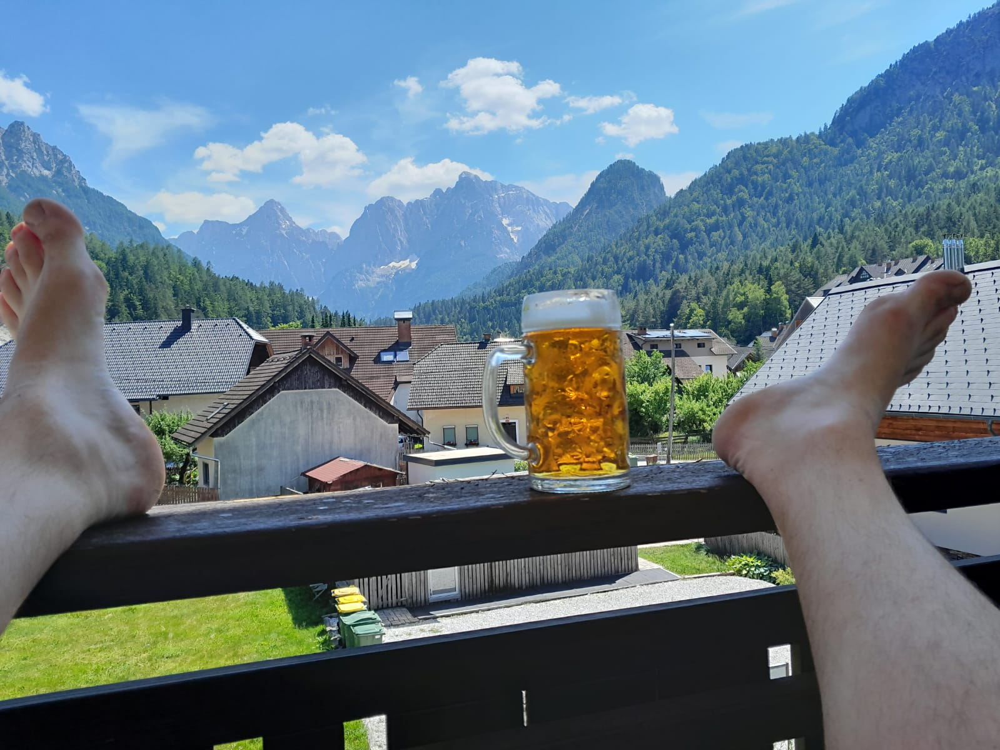
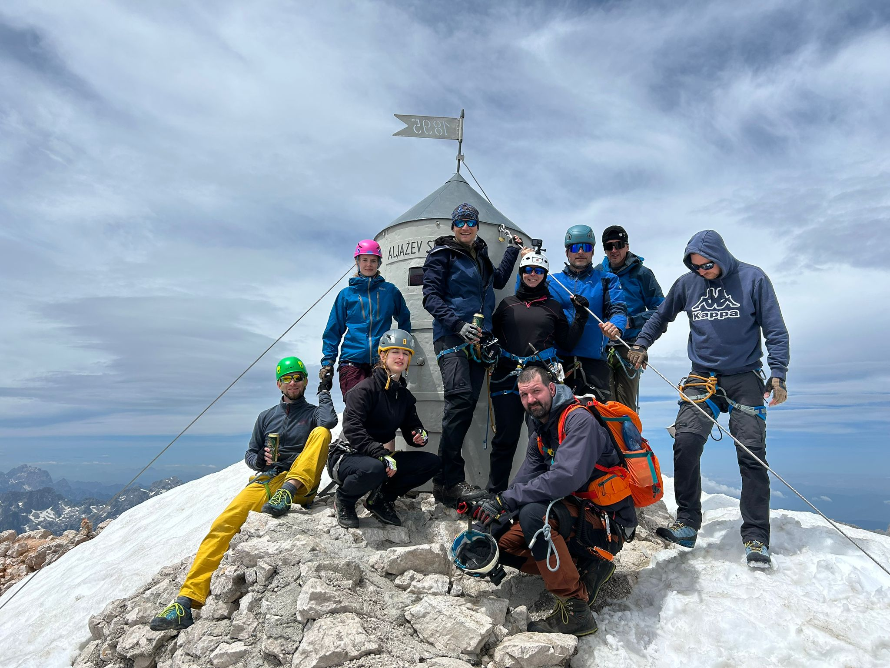
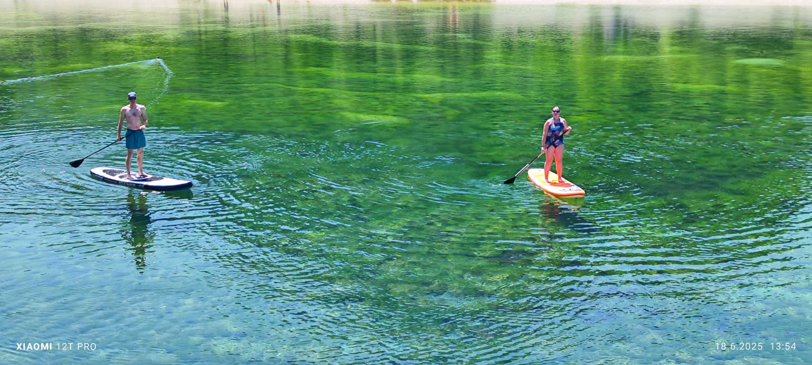
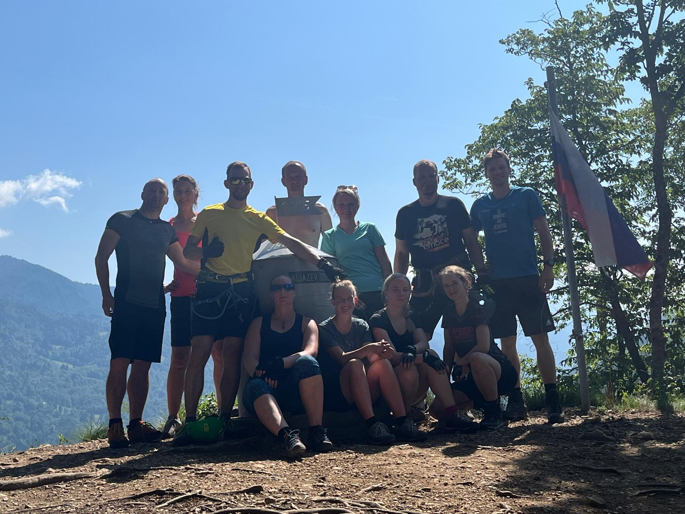

# :flag_si: 2025 - Slovinsko

{ width="100%" }
*Julské Alpy, červen 2025*

---

## :calendar: Základní informace

**Termín:** 14. - 21. června 2025 (7 dní)  
**Destinace:** Julské Alpy, Slovinsko (oblast Soča)  
**Ubytování:** Vitranc Apartments, Kranjska Gora  
**Účastníci:** 28 členů týmu  
**Počasí:** :sunny: Převážně slunečno, perfektní podmínky

---

## :mountain: Přehled výstupů a aktivit

| Datum | Aktivita | Výška | Obtížnost | Poznámka |
|-------|----------|-------|-----------|----------|
| **14.6.** | Příjezd a ubytování | - | - | Příjezd do oblasti Soča |
| **15.6.** | **Ciprnik + Visoka peč** | 1747 m / 1749 m | T3 | První společná výprava |
| **16.6.** | **Pramen Soči + soutěska** | - | T2 | 15 km procházka soutěskou |
| **17.6.** | **Triglav** | 2864 m | PD-E | 3 skupiny, ferraty Plamenica + Tomiškova |
| **18.6.** | **Odpočinkový den** | - | - | Jezero, paddleboard, sjezd řeky |
| **19.6.** | **4 ferraty** | - | C + E | 3 lehčí (C), 1 náročná (E) |
| **20.6.** | **Mala Mojstrovka** | 2333 m | B/C | Ferrata Hanzova pot (6 lidí, led!) |
| **21.6.** | Odjezd domů | - | - | Návrat do ČR |

---

## :hiking_boot: Den po dni

### 📅 Sobota 14. 6. 2025 - Příjezd

**Aktivita:** Příjezd a ubytování

Dorazili jsme do našeho ubytování Kranjska Gora v Julských Alpách. Po dlouhé cestě jsme se ubytovali a připravili na týden plný dobrodružství.

---

### 📅 Neděle 15. 6. 2025 - Ciprnik a Visoka peč

**Výstup:** Ciprnik (1747 m) + Visoka peč (1749 m)  
**Obtížnost:** T3  
**Typ:** První společná túra

{ width="100%" }

**Popis:** První společná výprava celého týmu! Všichni jsme vyrazili na Ciprnik (1747 m) a ti nejlepší z nás pokračovali dále až na **Visoka peč (1749 m)**. Skvělý rozcvičovací výstup s krásnými výhledy na Julské Alpy.

#### 🎬 Video z výstupu

<iframe width="100%" height="450" src="https://www.youtube.com/embed/kwMddtCIhWE" title="Ciprnik a Visoka peč" frameborder="0" allow="accelerometer; autoplay; clipboard-write; encrypted-media; gyroscope; picture-in-picture" allowfullscreen></iframe>

---

### 📅 Pondělí 16. 6. 2025 - Pramen Soči a soutěska

**Aktivita:** Procházka k pramenu řeky Soča  
**Délka:** ~15 km soutěskou  
**Obtížnost:** T2

{ width="100%" }

**Popis:** Navštívili jsme **pramen řeky Soča** – jedno z nejkrásnějších míst ve Slovinsku. Od pramene jsme se vydali na asi **15km procházku soutěskou** této smaragdově zelené řeky. Nádherná turkyzová barva vody a mohutné skály vytvářely úchvatnou scenérii.

---

### 📅 Úterý 17. 6. 2025 - Triglav (2864 m)

**Výstup:** Triglav - nejvyšší hora Slovinska  
**Výška:** 2864 m  
**Obtížnost:** PD až E (podle cesty)

{ width="100%" }

**Popis:** Hlavní vrchol naší výpravy! Byli jsme rozděleni do **tří skupin** podle obtížnosti:

#### Skupina 1 - Nejzdatnější (Ferratová cesta)
- **Nahoru:** Via ferrata **"Čez Plamenica"** (obtížnost D/E)
- **Dolů:** **Tomiškova puť** (ferrata C/D)
- Náročná, ale úchvatná cesta s exponovanými pasážemi

#### Skupina 2 - Střední (Standardní cesta)
- Turistická cesta přes Triglavski dom

#### Skupina 3 - Turistická
- Pohodovější varianta s delším přístupem

!!! success "Vrchol pro všechny!"
    Všechny tři skupiny úspěšně dosáhly vrcholu Triglavu!

#### 🎬 Video z výstupu

<iframe width="100%" height="450" src="https://www.youtube.com/embed/0BMQjmML804" title="Triglav - 1. díl" frameborder="0" allow="accelerometer; autoplay; clipboard-write; encrypted-media; gyroscope; picture-in-picture" allowfullscreen></iframe>

*První díl ze tří částí dokumentace výstupu na nejvyšší vrchol Slovinska.*

---

### 📅 Středa 18. 6. 2025 - Odpočinkový den u jezera

**Aktivita:** Relax a vodní sporty  
**Místo:** Horské jezero

{ width="100%" }

**Popis:** Zasloužený odpočinkový den po náročném výstupu na Triglav. **Tonda s Pájou (Pavlou)** jezdili na **paddleboardech** a také **sjeli kus řeky**. Ostatní relaxovali u vody, koupali se a nabírali síly na další dny.

---

### 📅 Čtvrtek 19. 6. 2025 - Den ferrat

**Aktivita:** 4 via ferraty  
**Obtížnost:** 3× C, 1× E

{ width="100%" }

**Popis:** Den věnovaný via ferratám! Tým byl rozdělen podle zkušeností:

#### Skupina základní - 3 lehčí ferraty (C)
- **Ferrata 1:** S vodopádem - úžasný zážitek!
- **Ferrata 2:** Soutěsková ferrata
- **Ferrata 3:** Třetí ferrata obtížnosti C

#### Skupina pokročilá - Extrémní ferrata (E)
Nejzdatnější z nás si dali ještě **čtvrtou ferratu obtížnosti E** – extrémně náročná, ale neskutečný adrenalin!

!!! info "Speciální ferraty"
    Jedna z ferrat vedla přímo kolem **vodopádu** a další procházela **soutěskou** – unikátní zážitky!

---

### 📅 Pátek 20. 6. 2025 - Mala Mojstrovka (2333 m)

**Výstup:** Mala Mojstrovka  
**Výška:** 2333 m  
**Ferrata:** Hanzova pot (B/C)  
**Obtížnost:** Komplikace - led!

{ width="100%" }

**Popis:** Plánovali jsme společný výstup přes ferratu **Hanzova pot (B/C)**, ale na místě jsme zjistili, že **velká část lana je pod ledem**! 

#### Rozdělení týmu:
- **6 nejzdatnějších jedinců** - Pokračovali ferratou přes led a dosáhli vrcholu Mala Mojstrovka
- **Ostatní členové** - Zvolili bezpečnější variantu a zdolali jiný vrchol v okolí

!!! warning "Nebezpečné podmínky"
    Led na ferratě byl nečekanou komplikací. Rozhodnutí rozdělit tým bylo správné - bezpečnost především!

#### 🎬 Video z výstupu

<iframe width="100%" height="450" src="https://www.youtube.com/embed/UOWa75FEyZE" title="Mala Mojstrovka" frameborder="0" allow="accelerometer; autoplay; clipboard-write; encrypted-media; gyroscope; picture-in-picture" allowfullscreen></iframe>

---

### 📅 Sobota 21. 6. 2025 - Odjezd

**Aktivita:** Návrat domů

Poslední den jsme zabalili, uklidili ubytování a vydali se na cestu zpět do České republiky. Hlavy plné zážitků a srdce plná krásných vzpomínek na Julské Alpy!

---

---

## :memo: Statistiky výpravy

| Kategorie | Hodnota |
|-----------|---------|
| **Počet účastníků** | 30 |
| **Celkem dní** | 7 |
| **Počet výstupů** | 5 |
| **Počet ferrat** | 7+ |
| **Nejvyšší bod** | 2864 m (Triglav) |
| **Úspěšnost vrcholů** | 100% |
| **Ujeto km autem** | ~1700 km |
| **Paddle board km** | Nezapomenutelné! 🏄 |

---

---

---

## :camera: Fotogalerie

