# 📜 Jak to celé vzniklo (Něco málo o nás)

Jsme parta přátel, která sdílí lásku k horám, horolezectví a dobrodružství. Naše cesty začaly již v dětství a postupně se z malé skupiny turistů stala velká rodina horolezců, cyklistů a milovníků přírody.

---

## 🏔️ Náš příběh

Vše začalo již v dětství Františka a Dalibora Cihlářových. **Jejich otec byl vášnivým turistou** a od mládí je vedl k lásce k horám. Společně pravidelně jezdili do **Slovenských Tater**, kde kluci získali pevné základy horské turistiky a respekt k přírodě.

František (Fici) se později věnoval práci s dětmi a společně s **Hankou Holíkovou každoročně vedou dětské tábory**, kde předávají lásku k přírodě další generaci.

### 🧗 Od turistiky k železným cestám

Zlomovým okamžikem v historii naší skupiny byl rok, kdy se **František (Fici)** a **Jan Nový** společně vydali do Alp. Honza, jakožto našeptávač adrenalinu, přiměl Františka vyzkoušet **via ferraty a klasické lezení**. 

Výsledek? Ficiho to natolik chytlo, že se stal vášnivým ferratistou a dnes jezdí po ferratách i sám. Jeho bratr **Dalibor (Dali)** však zůstal věrný klasické horské turistice – ferraty ho neoslovily, ale pokud jde o šlapání do kopce s batohem plným piv, nemá konkurenci.

### 👨‍👩‍👧‍👦 Jak se naše řady rozrůstaly

Původně naše parta čítala jen asi **šest skalních členů**. Postupně se ale nabalovali další skvělí lidé, až vznikla sestava, kterou znáte dnes.

Zlomový byl **rok 2021**, kdy se přidal správce této kroniky, **Jan Wimmer**. Traduje se, že kudy chodil, tudy vyprávěl, jaké výšky zdolává. Až na skále zjistil, že má vlastně docela strach z výšek. I tak s námi zůstal a strach statečně překonává a nahrazuje ho nadšením pro techniku a dokumentaci (a nošením nejtěžšího batohu).

O rok později, **v roce 2022**, dorazila velká posila humoru – bratránci **Tonda Firýt a Radek Hacker**. Od té doby jsou naše videa (k radosti střihače) plná jejich vtipných hlášek. Tým „mladých pušek“ kolem třicítky tehdy doplnil i **Kuba Fišar**.

V **roce 2023** proběhla invaze klanu Žaludů. **Zdeněk Žalud** s sebou vzal rovnou celou rodinu: manželku **Petru** a dcery **Áďu s Terezkou**. Věkový průměr party směrem dolů pomohl udržet nováček **Petr Nový**.

**Rok 2024** byl ve znamení rodinných vazeb. Náš organizátor František vzal během roku dceru **Terku Cihlářovou** cvičně vyzkoušet ferraty. Terku to chytlo tak moc, že se rovnou rozhodla jet s námi na velkou společnou dovolenou a od té doby je naší stálou členkou. Tonda ten rok přibral staršího bratra **Lukáše Firýta**, Zdeněk syna **Filipa** a Háňa kamarádku **Petru Čechránkovou**.

V zatím posledním roce 2025 se kruh uzavírá a rozšiřuje o partnery a přátele. Terka přivedla přítele **Ondru** (vášnivý sportovec, hraje podvodní hokej a večery nám zpříjemňuje hrou na kytaru). Áďa vzala spolužačku **Beatu**, Tonda kamarádku **Páju** a Láďa svého parťáka **Františka Eliáše**.

### 🍺 Pivní tradice

Naší vášní není jen sport, ale i **objevování malých pivovarů z různých koutů České republiky**! Především **Fici a Dali** mají zálibu v craft pivech a na základě jejich poznání vozíme na každoroční dovolenou **celé sudy** jako občerstvení. Klasické značky u nás nemají šanci – jen to nejlepší z českých minipivovarů!

### 🚴 Další aktivity

S rostoucím počtem členů přibyly i další aktivity:

- **Rodina Žaludů** ráda jezdí na **horských kolech**
- **František Ptáček a Josef Kovařík** společně objevují hory na **elektrokolech**
- **Pája** si užívá vodní sporty na **paddle boardu**
- **Maruška s Jakubem Fišarem** mají čerstvě **holčičku** – nejmladšího člena naší rozšířené rodiny.

---

## 👨‍👩‍👧‍👦 Organizační tým

    
    

        <h3>🧗‍♀️ František Cihlář "Fici"</h3>
        
<strong>Role:</strong> Generální ředitel zájezdu 
        <strong>Nejoblíbenější aktivita:</strong> Plánování a koordinace výprav

        
<em>„Mozek operace a Pán itinerářů. Kdyby nenaplánoval i přestávky na dýchání, 
        pravděpodobně bychom na to zapomněli. Jeho před-dovolenkové srazy jsou legendární a 
        informačně výživnější než večerní zprávy. Bez něj bychom sice taky někam dojeli, 
        ale nikdo neví kam a kdy."</em>

    

---

    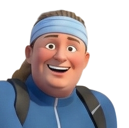
    

        <h3>🥾 Dalibor Cihlář "Dali"</h3>
        
<strong>Role:</strong> Lovčí a pivní someliér 
        <strong>Superschopnost:</strong> Čekání na pstruha

        
<em>„Zatímco my funíme do kopce, on už tam pravděpodobně spal pod širákem. Zásobovač týmu čerstvými proteiny z řeky a znalec malých pivovarů. Pokud ho nenajdete na stezce, stojí po pás ve vodě a vede tichý monolog s rybami. S bratrem tvoří elitní pivní degustační jednotku.“</em>

    

---

    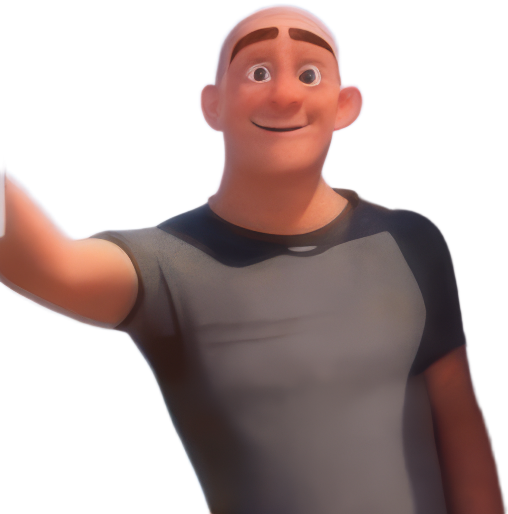
    

        <h3>🧗‍♀️ Jan Nový</h3>
        
<strong>Role:</strong> Ghost Rider & Rumový guru 
        <strong>Superschopnost:</strong> Broušení kolen v zatáčkách

        
<em>„Jediný člen, který se na hory dostane dřív než jeho stín. Miluje serpentýny, kolmé stěny a technické lezení, kde je gravitace jen doporučením. Pivo považuje za iontový nápoj pro slabochy, proto večerní porady vede zásadně se sklenkou rumu v ruce.“</em>

    

---

    
    

        <h3>🥾 Hanka Holíková</h3>
        
<strong>Role:</strong> Strážkyně žaludků 
        <strong>Superschopnost:</strong> Vyčarovat hody uprostřed divočiny

        
<em>„Nejdůležitější osoba expedice, protože hladový horal = zlý horal. S lehkostí vyběhne na dvoutisícovku (VHT je její revír), aby nám nahoře s úsměvem oznámila, co dobrého bude k večeři. Její kulinářské umění nás drží při životě.“</em>

    

---

## 👥 Ostatní členové týmu

    
    

        <h3>🧗‍♀️ Tereza Cihlářová "Terka"</h3>
        
<strong>Role:</strong> Energetická smršť 
        <strong>Superschopnost:</strong> Neunavitelnost

        
<em>„Dcera pluku, která snižuje věkový průměr a zvyšuje tepovou frekvenci. Jakmile se cvakne karabinou na ocelové lano, přepne do režimu 'veverka' a odmítá slézt dolů. Ferraty, bouldery, skály – pokud se na to dá vylézt, Terka už tam je.“</em>

    

---

    
    

        <h3>🧗‍♀️ Ondřej Macek</h3>
        
<strong>Role:</strong> Kulturní referent & Obojživelník 
        <strong>Superschopnost:</strong> Hokej pod vodou (nekecám!)

        
<em>„Jukebox na nožičkách. Přes den sportovní terminátor, který zvládne vše od VHT po podvodní hokej, večer bard, bez jehož kytary by byl rum jen smutné pití. Ferraty dává k snídani a ještě u toho stíhá ladit struny.“</em>

    

---

    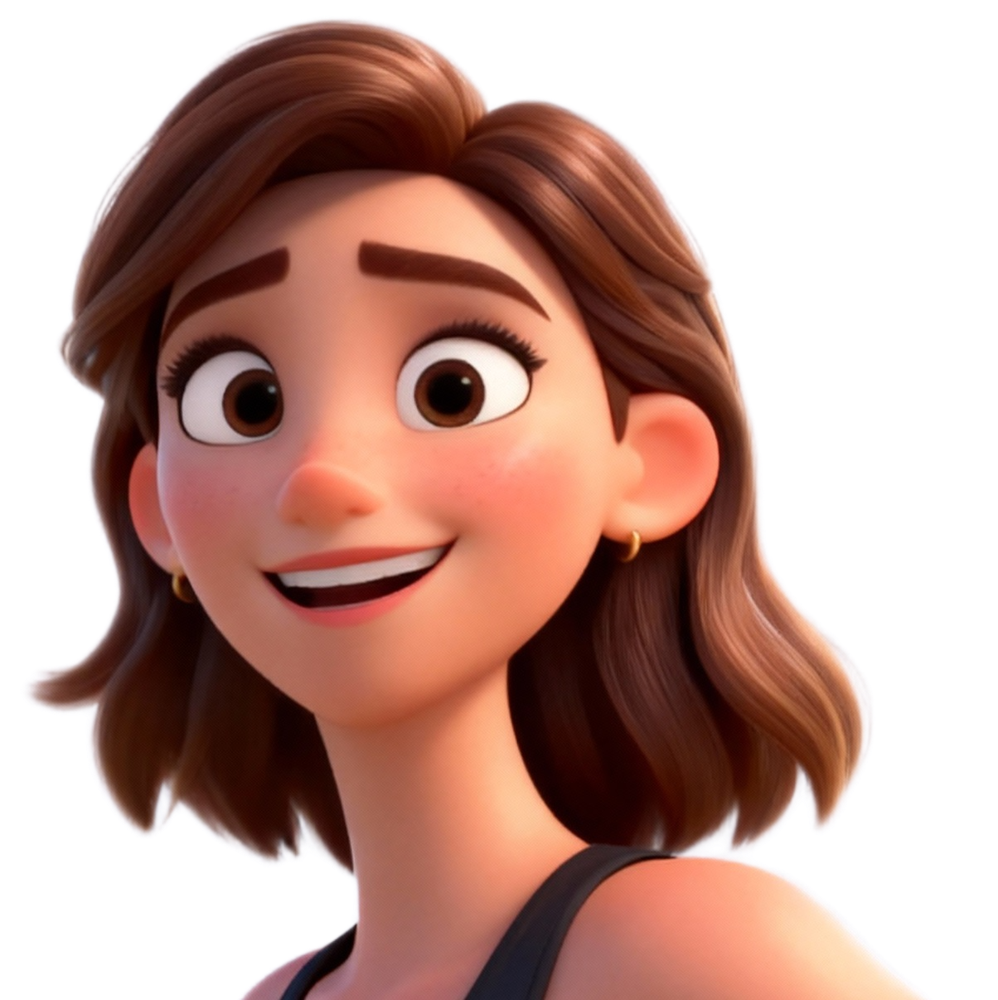
    

        <h3>🧗‍♀️ Alice</h3>
        
<strong>Role:</strong> Vertikální tanečnice 
        <strong>Superschopnost:</strong> Elegance na skále

        
<em>„Kde ostatní hledají schody nebo lanovku, Alí hledá chyt. Společně s Honzou tvoří lezecké úderné komando. Ať už je to ferrata nebo klasická skála, pohybuje se tam s přehledem, který jí my ostatní, visící v křeči na laně, tiše závidíme.“</em>

    

---

    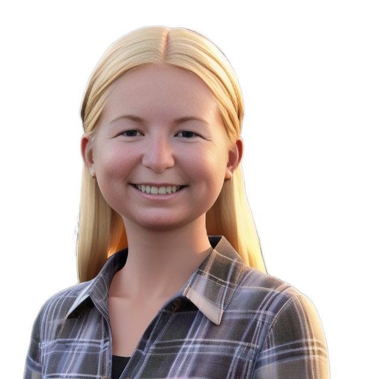
    

        <h3>🏄‍♂ Pavla Ronovská "Pája"</h3>
        
<strong>Role:</strong> Vodní živel 
        <strong>Superschopnost:</strong> Chůze po vodě (s pádlem)

        
<em>„Žena, která do našich horských deníků propašovala vodu. Když zrovna nezdolává ferraty nebo horské štíty, nafukuje paddleboard v nadmořských výškách, kde by jiní hledali kyslík. Univerzální voják pro pevninu, skálu i hladinu.“</em>

    

---

    
    

        <h3>🥾 Petra Čechránková</h3>
        
<strong>Role:</strong> Krušnohorská spojka & Horal-chodec 
        <strong>Superschopnost:</strong> Najít vrchol bez použití rukou

        
<em>„Do Alp nám ji přivála Hanka a od té doby tvoří nerozlučné turistické duo. Zatímco ostatní visí na ocelových lanech a bojují s gravitací, Petra s úsměvem a nohama pevně na zemi zdolává jeden alpský štít za druhým. Důkaz, že k výhledům se dá dojít i důstojně a bez lezeckého úvazku zařezaného v tříslech.“</em>

    

---

    
    

        <h3>🧗‍♀️ Antonín Firýt "Tonda"</h3>
        
<strong>Role:</strong> Admin WhatsAppu & Pán Bezpečnosti 
        <strong>Superschopnost:</strong> Běh se zátěžovou vestou (dobrovolně!)

        
<em>„Otec našich chatovacích skupin a milovník bolesti. Je to perfekcionista, který by nejraději oštítkoval i kameny na cestě, aby byly bezpečné. Když už leze, tak jedině 'vraždy' obtížnosti E nebo F, a když běhá, bere si zátěžovou vestu, aby to náhodou nebylo moc lehké. Největší motivátor týmu, který vás vytáhne nahoru, i když už necítíte nohy.“</em>

    

---

    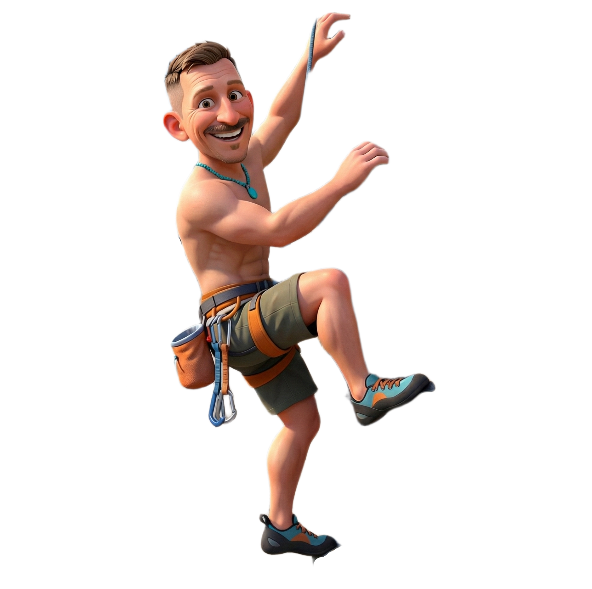
    

        <h3>🧗‍♀️ Radek Hacker</h3>
        
<strong>Role:</strong> Hlavní spammer & Vrchařská muší váha 
        <strong>Superschopnost:</strong> Porušování fyzikálních zákonů

        
<em>„Tondův bratranec a druhá polovina jejich komediálního dua. Díky své atletické postavě a muší váze po skalách spíše levituje, než leze. Je to vrchní zásobovač našich telefonů zprávami a autor hlášek, které ve videu (pokud ho Honza někdy sestříhá) zlidoví. Kde my funíme, Radek už nahoře svačí.“</em>

    

---

    
    

        <h3>🧑‍💻 Jan Wimmer</h3>
        
<strong>Role:</strong> Webmaster & Šerpa elektrotechniky 
        <strong>Superschopnost:</strong> Odkládání střihu videa na neurčito

        
<em>„Otec zakladatel tohoto webu. Poznáte ho snadno – je to ten muž, co funí pod batohem plným baterek, dronů a kamer, který je těžší než on sám. Dron s sebou nosí hlavně na procházku, aby neporušil letové předpisy. Ač se bojí výšek, hrdinně se vrhá na skály, aby překonal sám sebe (a natočil záběry, které uvidíme pravděpodobně až v důchodu).“</em>

    

---

    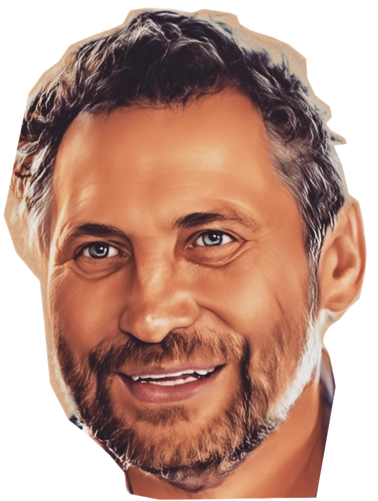
    

        <h3>🚴‍♂️ František Ptáček "Fanda"</h3>
        
<strong>Role:</strong> Emeritní náčelník & Šéfkuchař 
        <strong>Superschopnost:</strong> Proměnit jakékoliv maso v gastronomický zážitek

        
<em>„Bývalý vrchní mistr, který vyměnil drážní předpisy za recepty na guláš. Do kopců vyráží s elektrickou dopomocí, aby měl nahoře dost sil na to nejdůležitější – obhlídku místní kultury a kuchyně. Je to náš gastronomický maják; když zavoní jeho udírna nebo kotlík, všichni víme, kde je základní tábor.“</em>

    

---

    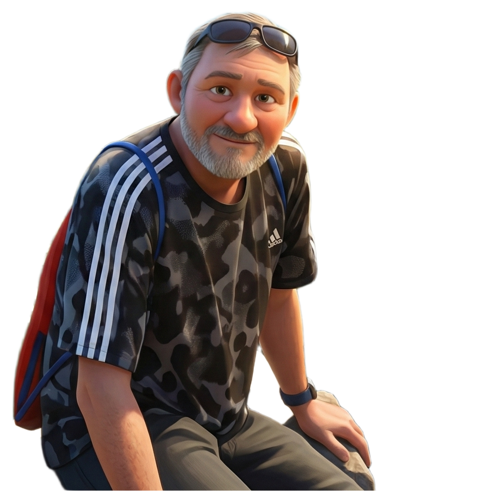
    

        <h3>🚴‍♂️ Josef Kovařík "Pepa"</h3>
        
<strong>Role:</strong> Křídlo elektroletky & Požitkář 
        <strong>Superschopnost:</strong> Zenový klid s cigaretou v ruce

        
<em>„Fandův parťák ve zbrani (a na elektrokole). Pepa dokazuje, že hory nejsou jen o potu a krvi, ale i o krásných výhledech z terasy s oroseným pivem. Rád si vyjede na kopec, ale jen na takový, který dává smysl. Je mistrem disciplíny 'alpská pohoda', kterou vyučuje každý večer na balkoně apartmánu.“</em>

    

---

    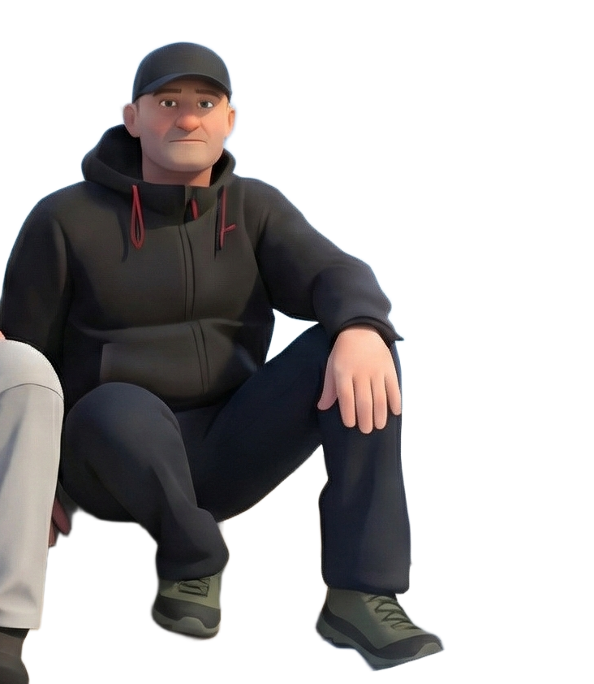
    

        <h3>📷 František Eliáš</h3>
        
<strong>Role:</strong> Fotografický kouzelník 
        <strong>Superschopnost:</strong> Zlaté oko v mobilu

        
<em>„Tichá voda, která břehy (a fotky) mele. Je to vlk samotář, který se nebojí odpojit od stáda a jít si svým tempem. Zatímco my taháme kila fototechniky, on vytáhne z kapsy telefon a udělá fotku, která by vyhrála na Instagramu. Večer u piva nás pak svými úlovky pravidelně posílá do kolen.“</em>

    

---

    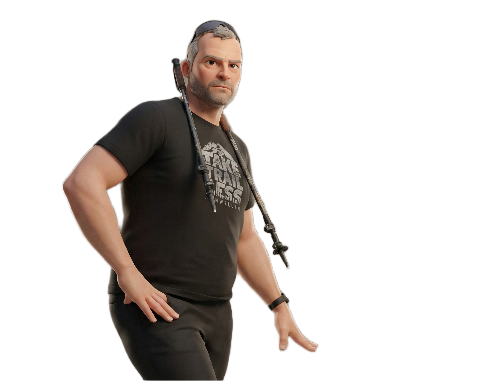
    

        <h3>🚴 Zdeněk Žalud</h3>
        
<strong>Role:</strong> Otec zakladatel (cyklistické sekce) & Ferratový terminátor 
        <strong>Superschopnost:</strong> Ignorování bolesti

        
<em>„Původně čistokrevný cyklista, kterého jsme zkazili – teď už visí na ocelovém laně častěji než na řídítkách. Jeho poznávacím znamením je bandáž na koleni, která tam pravděpodobně už přirostla. Je živoucím důkazem, že co nejde silou, jde ještě větší silou a vůlí. Rok od roku si nakládá těžší cesty a my jen čekáme, kdy to koleno vymění za bionické.“</em>

    

---

    
    

        <h3>🚴 Petra Žaludová</h3>
        
<strong>Role:</strong> Zdravotní dozor & Paní Rovnováha 
        <strong>Superschopnost:</strong> Udržet tempo a úsměv

        
<em>„Zatímco Zdeněk hledá, kde by se mohl zničit, Petra vnáší do rodinných výprav rozum a pohodu (a taky zdravotnickou odbornost, což se u Zdeňka hodí). Na kole i na skále preferuje cesty, kde se člověk nemusí bát o život každou vteřinu. Její doménou jsou ferraty 'na kochačku', kde si člověk užije výhledy a ne jen pohled na skálu 5 cm od obličeje.“</em>

    

---

    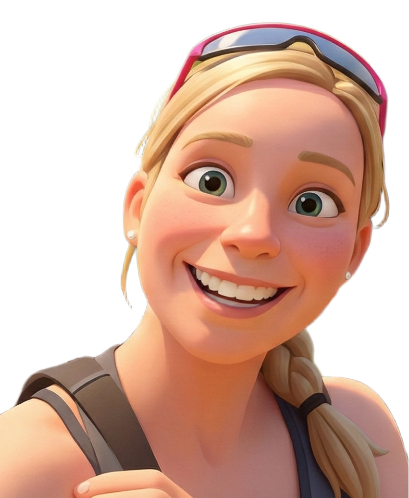
    

        <h3>🥾 Adéla Žaludová "Áďa"</h3>
        
<strong>Role:</strong> MUDr. Kochačka & Paní Rozumná 
        <strong>Superschopnost:</strong> Chirurgicky přesný výběr pohody

        
<em>„Budoucí paní doktorka, která vyměnila bílý plášť za pohorky. Do hor vnáší element rozvahy a stejně jako mamka Petra razí heslo, že dovolená má být o zážitcích, ne o boji o život. Zatímco otec se sestrou visí v převisech a pokoušejí gravitaci, Áďa si vybírá cesty, kde může v klidu aplikovat své znalosti anatomie na kochání se krajinou, nikoliv na počítání vlastních modřin.“</em>

    

---

    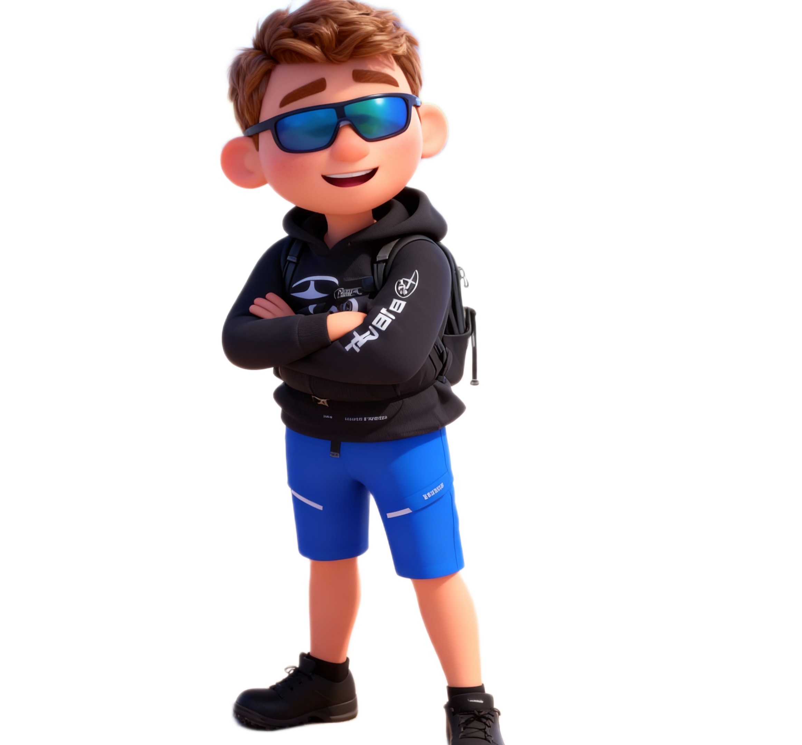
    

        <h3>🚴 Filip Žalud</h3>
        
<strong>Role:</strong> Cyklistický disident 
        <strong>Superschopnost:</strong> Hledání pedálů na skále

        
<em>„Člen rodiny, který má podezření, že ty hory by byly mnohem lepší, kdyby se daly sjet na kole. Ferraty sice vyleze (protože geny se nezapřou), ale v jeho očích vidíte tu touhu po dvou kolech a přehazovačce. Je to náš tichý cyklo-agent v týmu horolezců.“</em>

    

---

    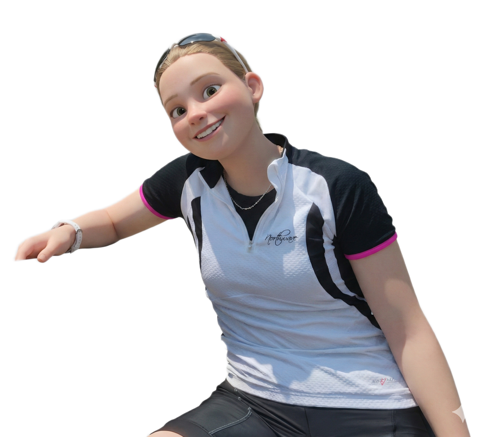
    

        <h3>🚴 Tereza Žaludová</h3>
        
<strong>Role:</strong> Zdeňkův parťák & Skrytý drak 
        <strong>Superschopnost:</strong> Absence pudu sebezáchovy (po tátovi)

        
<em>„Terezka je mistr klamání tělem. Na zemi působí nenápadně, ale jakmile se dotkne skály, mění se v lezecký stroj. Je to tátova věrná parťačka do nepohody a do úseků, kde ostatním tuhne úsměv na rtech. Loňský rok sice vynechala, ale všichni netrpělivě čekáme na její velkolepý comeback. Pokud naváže tam, kde skončila, máme se na co těšit – kde my hledáme stupy, ona prostě běží nahoru.“</em>

    

---

    
    

        <h3>🥾 Beata Sanvenero</h3>
        
<strong>Role:</strong> Nadšený nováček & Ádina pravá ruka 
        <strong>Superschopnost:</strong> Okamžitá závislost na karabinách

        
<em>„Objev roku, kterého do hor přitáhla Áďa (asi aby si odpočinuly od učení). Sotva si poprvé cvakla karabinu na lano, rozzářily se jí oči a bylo jasné, že je 'naše'. Ferratový virus u ní zabral okamžitě a vypadá to, že léčba pobytem v nížinách nezabírá – musí s námi jezdit dál.“</em>

    

---

    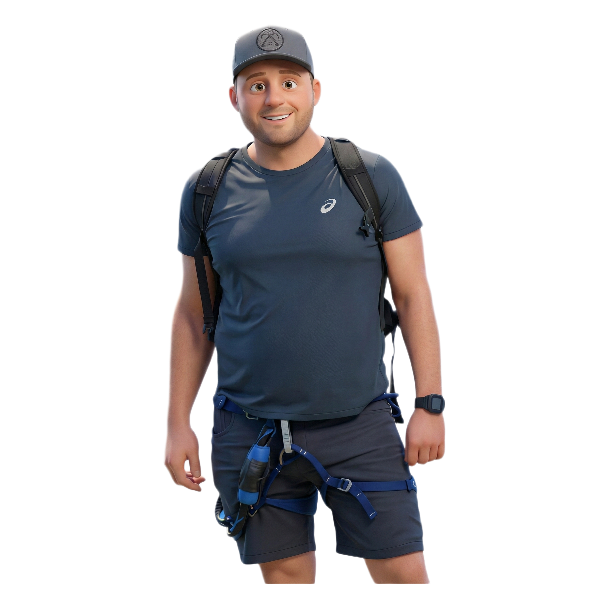
    

        <h3>🥾 Ladislav Kasl "Láďa"</h3>
        
<strong>Role:</strong> Drážní svalovec 
        <strong>Superschopnost:</strong> Zvedání činek i nálady

        
<em>„Když zrovna nevypravuje vlaky, pumpuje železo v posilovně, což se v horách hodí. Ferraty drtí silou, a když dojde skála, vezme batoh a vyrazí na túru. Je to náš obojživelník – dopoledne visí na laně, odpoledne se cachtá v ledovcovém jezeře. Má rád balanc mezi adrenalinem a relaxem.“</em>

    

---

    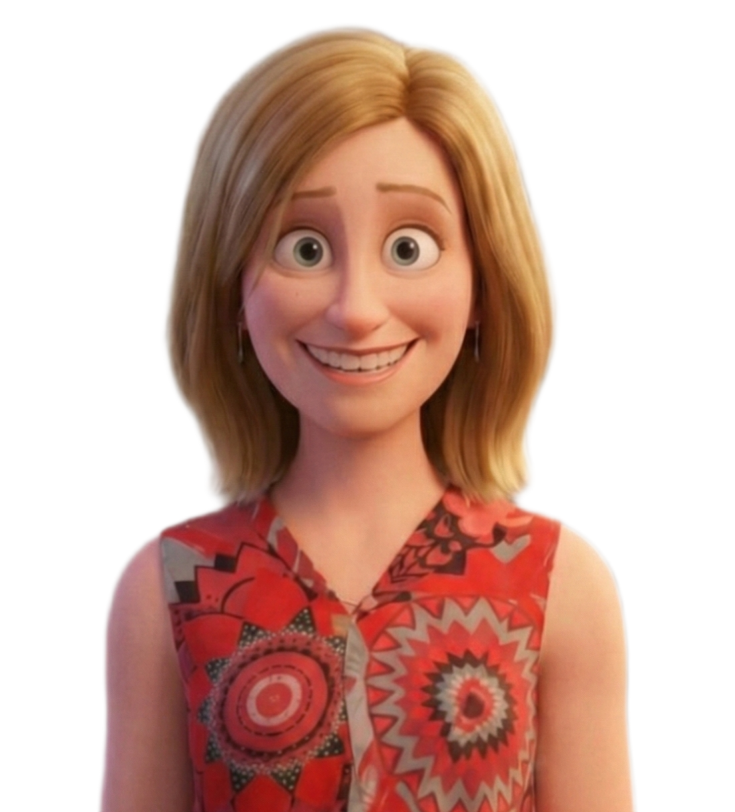
    

        <h3>🥾 Petra</h3>
        
<strong>Role:</strong> Paní Pohoda & Lovkyně výhledů 
        <strong>Superschopnost:</strong> Lehkost bytí (a batohu)

        
<em>„Láďova lepší polovička a nejchytřejší člen výpravy – jako jedna z mála totiž pochopila, že dovolená má být i odpočinek. Zatímco my se dřeme do kolmých stěn, Petra si s malým batůžkem dojde pro ty nejhezčí výhledy a pak nás s úsměvem čeká na pláži u jezera. Specializuje se na 'kochací' turistiku.“</em>

    

---

    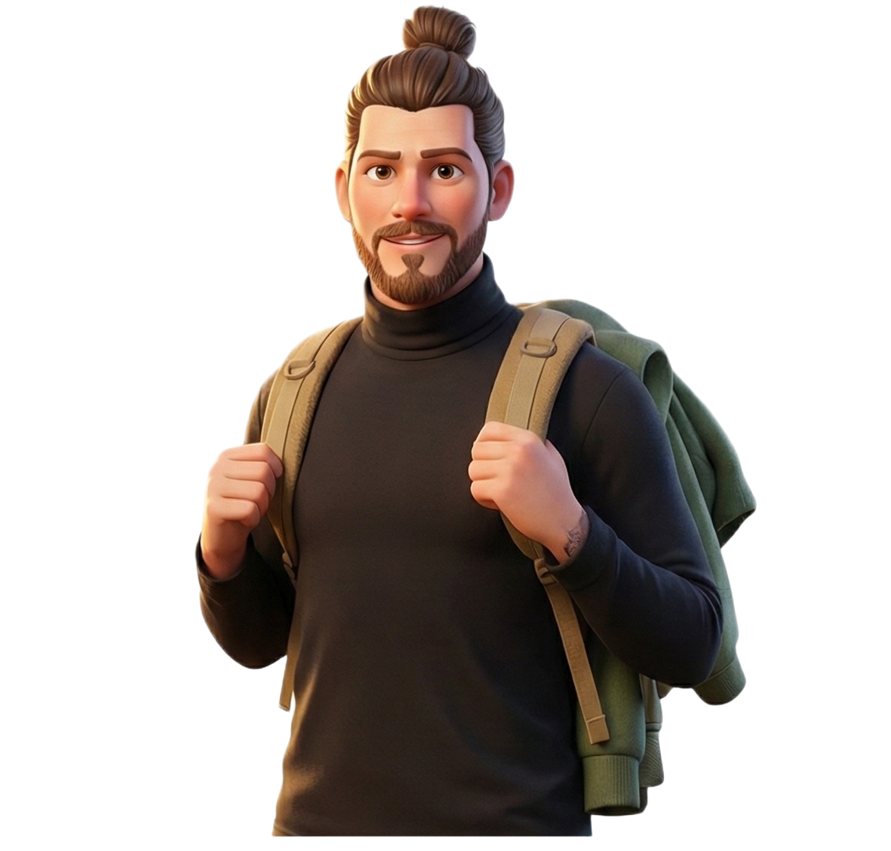
    

        <h3>🧗‍♀️ Petr Nový "Sunschi"</h3>
        
<strong>Role:</strong> Terminátor & Ginový aristokrat 
        <strong>Superschopnost:</strong> God Mode (Nekonečná stamina)

        
<em>„Muž, který si před příchodem do hor asi aktivoval cheat kód na nesmrtelnost. Hned na poprvé vylezl 'Ečkovou' ferratu, jako by šel na nákup, a na třítisícovku bez cesty vylezl po skále, zatímco zbytek výpravy dole hledal kyslík. Je to vedoucí turistické sekce západních Čech a milovník adrenalinu. Pozor, na rozdíl od nás barbarů nepije pivo ani rum – jeho palivem je Gin s Tonicem. Po pauze se vrací, aby nám znovu ukázal, jak špatnou máme kondičku.“</em>

    

---

    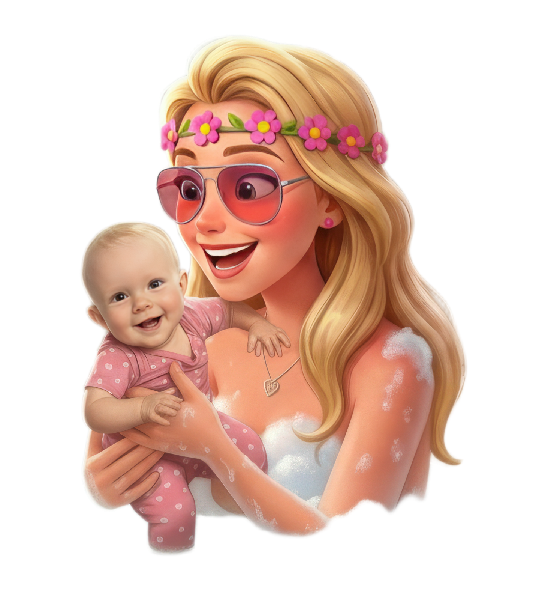
    

        <h3>🥾 Maruška</h3>
        
<strong>Role:</strong> Blondýna v akci & Budoucí nosička krosny 
        <strong>Superschopnost:</strong> Zvládat ferratu i mateřství s elegancí

        
<em>„Důkaz, že i křehká blondýnka může mít stisk horolezce. Na skále s Jakubem drží basu, ale na rozdíl od něj u toho vypadá, že se ani nezapotila. Příští rok ji čeká největší výzva – role 'Baby Sherpy' pro nejmladší členku výpravy. Očekáváme, že pleny bude měnit zavěšená v převisu.“</em>

    

---

    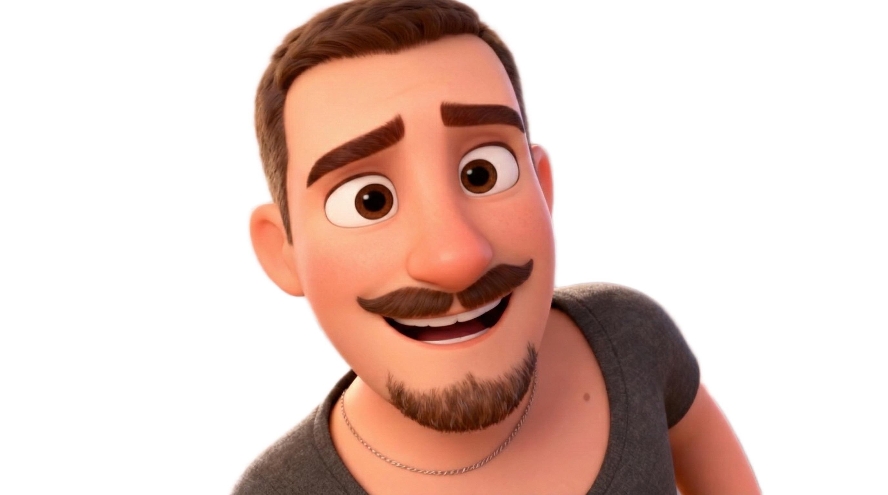
    

        <h3>🥾 Jakub Fišar</h3>
        
<strong>Role:</strong> Horský linebacker & Čerstvý taťka 
        <strong>Superschopnost:</strong> Prorážení vzduchu rameny

        
<em>„Americký fotbalista, který se rozhodl, že skály jsou jen další soupeř, kterého je třeba složit k zemi. Je to hora svalů, co leze po horách. Ferraty si dává k snídani (pokud jsou ve stínu), protože jeho jediným kryptonitem je přímé polední slunce, které ho minule poslalo na střídačku. Teď, posílen otcovstvím, se vrací do hry!“</em>

    

---

    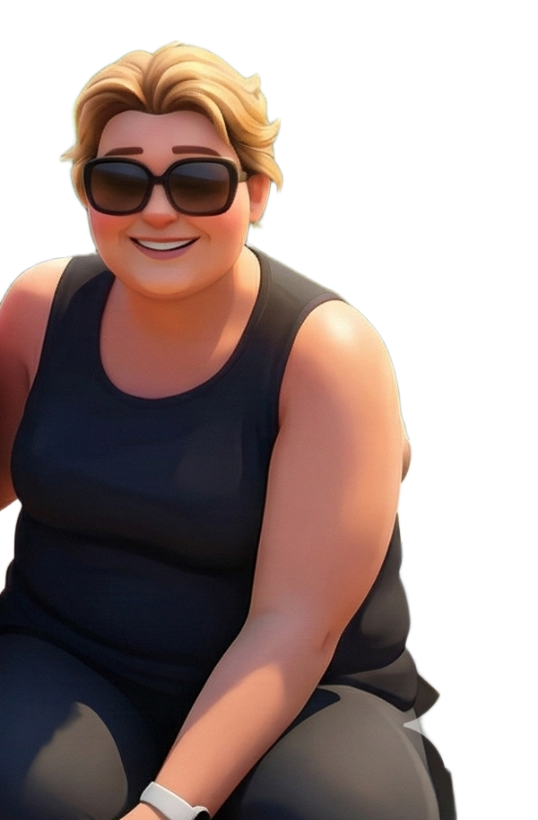
    

        <h3>🥾 Mařenka</h3>
        
<strong>Role:</strong> Paní Vytrvalost & Babička pluku 
        <strong>Superschopnost:</strong> Dieselový motor (pomalý rozjezd, nezastavitelný tah)

        
<em>„Ferratové úvazky přenechává mladším, ale jakmile se jde pěšky, zapíná svůj vnitřní diesel. Možná netrhá rekordy ve sprintu do kopce, ale má povahu buldoka – jakmile se zakousne do trasy, nepustí, dokud není u vrcholového kříže. Je to morální opora týmu, která nám připomíná, že důležité je dojít, ne doletět.“</em>

    

---

## Naše filozofie:

!!! quote "Co nás spojuje"
    **🤝 Přátelství** - Vzájemná důvěra a podpora  
        U nás znamená to, že tě nenecháme viset ve stěně samotného (většinou). Trpíme Radkův spam ve skupině, čekáme, až Fici dopiluje Excel, a věříme, že Honza ta videa sestříhá ještě před naší smrtí. 

    **🛡️ Bezpečnost** - Nikdy neriskujeme víc, než je nutné  
        Fungujeme v dynamické rovnováze mezi Tondovým "oštítkuj každý kámen" a Zdeňkovým "bolest je jen informace". A když všechno selže, máme Petru a Áďu, které nás sešijí dohromady.

    **🧪 Respekt k přírodě** - Hory chráníme a nenecháváme tam odpadky  
        Nejsme jen horolezci, jsme i výškoví badatelé. Díky obětavosti našich organizátorů (kteří ty vzorky táhnou na zádech) provádíme na každém vrcholu důležitý experiment: zkoumáme vliv piva z malých pivovarů na lidský organismus a motoriku v řídkém vzduchu. A hlavně: co si do hor vyneseme – od plných plechovek přes drony až po prázdné obaly – to si zase poctivě sneseme dolů.

    **📸 Zážitky** - Nejsou důležité jen vrcholy, ale celá cesta  
        Zážitek nemusí být pozitivní, hlavně že je silný! Ať už je to "éčková" ferrata, kde tuhne krev v žilách, nebo večerní "pohoda", po které bolí hlava. Důležité je dojít... a mít to vyfocené na Instagram.

!!! quote "Naše destero (ve čtyřech bodech)"
    1.  **Nikdo není pozadu** – ledaže by Radek zrovna levitoval napřed, nebo Honza měnil baterku v dronu.
    2.  **Hydratace je základ** – ať už je to voda, pivo z malých várek, nebo Sunschiho „horský speciál“ (Gin&Tonic).
    3.  **Bolest je volitelná** – pro Zdeňka a Jakuba výzva, pro zbytek důvod k zastávce na kochačku.
    4.  **Plán je svatý (ale Excel snese všechno)** – Ficiho tabulky nás vedou, ale realita a počasí nás vychovávají.

## Statistiky týmu

| Kategorie | Počet |
|-----------|-------|
| **Celkem členů** | 35 |
| **Společných výprav** | 6 |
| **Vylezených cest** | 47+ |
| **Ferraty** | 32 |
| **Klasické výstupy** | 15 |
| **Ušlých kilometrů** | 350+ km |
| **Nastoupaných metrů** | 42 000+ m |

---

