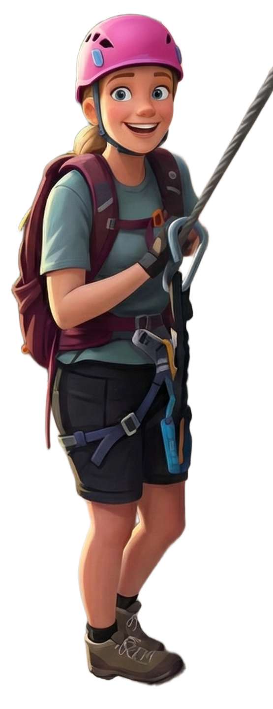
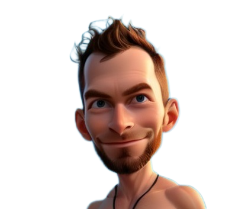

# :busts_in_silhouette: O nás

Jsme parta přátel, která sdílí lásku k horám, horolezectví a dobrodružství. Naše cesty začaly již v dětství a postupně se z malé skupiny turistů stala velká rodina horolezců, cyklistů a milovníků přírody.

---

## 🏔️ Náš příběh

Vše začalo již v dětství Františka a Dalibora Cihlářových. **Jejich otec byl vášnivým turistou** a od mládí je vedl k lásce k horám. Společně pravidelně jezdili do **Slovenských Tater**, kde kluci získali pevné základy horské turistiky a respekt k přírodě.

František (Fici) se později věnoval práci s dětmi a společně s **Hankou Holíkovou každoročně vedou dětské tábory**, kde předávají lásku k přírodě další generaci.

### 🧗 Od turistiky k ferratám

Zlomovým okamžikem byl rok, kdy se **František a Jan Nový** společně vydali do Alp. Jan Františka přiměl vyzkoušet **via ferraty a klasické lezení**. Ficiho to natolik chytlo, že se stal vášnivým ferratistou a dnes jezdí po ferratách i sám. Jeho bratr **Dalibor** zůstal věrný horské turistice – ferraty ho tolik neoslovily, ale jako horský turista nemá konkurenci.

### 👨‍👩‍👧‍👦 Rozšiřování party

Parta původně jezdila jen asi **v šesti lidech**. Postupně se přidávali další členové:

- **V roce 2021** se přidal **Jan Wimmer** (správce této kroniky)
- **V roce 2022** Jan přivedl **Tondu Firýta a Radka Hackera** – oba zkušené lezce s vášní pro klasické lezení, kteří s námi od té doby jezdí každoročně
- **V roce 2024** se poprvé připojila **Terka** (Františkova dcera) kde si i poprvé vyzkoušela ferraty, které ji okamžitě oslovily
- **V roce 2025** Terka vzala i svého přítele **Ondru**, kterého potkala v roce 2024. Ondřej je vášnivý sportovec a hraje speciální sport – **podvodní hokej**!
- Téhož roku 2025 se poprvé připojili i **Beata Sanvenero** (kamarádka Ádi Žaludové) a **František Eliáš** (kamarád Ládi Kasla)

### 🍺 Pivní tradice

Naší vášní není jen sport, ale i **objevování malých pivovarů z různých koutů České republiky**! Především **Fici a Dali** mají zálibu v craft pivech a na základě jejich poznání vozíme na každoroční dovolenou **celé sudy** jako občerstvení. Klasické značky u nás nemají šanci – jen to nejlepší z českých minipivovarů!

### 🚴 Další aktivity

S rostoucím počtem členů přibyly i další aktivity:

- **Rodina Žaludů** ráda jezdí na **horských kolech**
- **František Ptáček a Josef Kovařík** společně objevují hory na **elektrokolech**
- **Pája** si užívá vodní sporty na **paddle boardu**
- **Maruška s Jakubem Fišarem** mají čerstvě **holčičku** – nejmladšího člena naší rozšířené rodiny.

---

## 👨‍👩‍👧‍👦 Organizační tým

### :climbing: František Cihlář "Fici"

{ width="300" align=left }

**Role:** Hlavní organizátor  
**Nejoblíbenější aktivita:** Plánování a koordinace výprav  

František je hlavním organizátorem našich výprav. Jeho schopnost plánovat a koordinovat celou skupinu zajišťuje, že vše probíhá hladce.

---

### :mountain: Dalibor Cihlář "Dali"

{ width="300" align=left }

**Role:** Spoluorganizátor  
**Spojení:** Bratr Františka  

Dalibor podporuje organizaci výprav a pomáhá s logistikou. Jeho spolehlivost je pro tým klíčová.

---

### :woman_climbing: Tereza Cihlářová "Terka"

{ width="300" align=left }

**Role:** Členka týmu  
**Spojení:** Dcera Františka  

Terka přináší do týmu mladou energii a entusiasmus. Miluje horské výzvy a nové zážitky.

---

### :man_climbing: Ondřej Macek

{ width="300" align=left }

**Role:** Člen týmu  
**Spojení:** Přítel Terky  

Ondřej je vášnivý horolezec, který rád zdolává náročné ferraty a výstupy.

---

## 👥 Členové týmu

### 🧗 Lezci a ferratisté

**Hans s Alí** - Jan přivedl Ficiho k ferratám, zkušený horolezec. Alice je jeho přítelkyně a společnice na cestách.

**Tonda Firýt & Radek Hacker** - Zkušení lezci s vášní pro klasické lezení. S námi jezdí od roku 2022.

**Jan Wimmer** - Správce kroniky a webových stránek. Člen týmu od roku 2021.

---

### 🚴 Cyklisté a vodní sporty

**František "Fanda" Ptáček & Josef Kovařík** - Duo na elektrokolech

**Pavla Ronovská** - Paddle board specialistka

---

### 👫 Páry a přátelé

**František Eliáš** - Kamarád Ládi Kasla, poprvé v roce 2025

**Beata Sanvenero** - Kamarádka Adély Žaludové, poprvé v roce 2025

---

## Naše filozofie

!!! quote "Co nás spojuje"
    **Přátelství** - Nejdůležitější je vzájemná důvěra a podpora  
    **Bezpečnost** - Nikdy neriskujeme víc, než je nutné  
    **Respekt k přírodě** - Hory respektujeme a chráníme  
    **Zážitky** - Nejsou důležité jen vrcholy, ale celá cesta

## Statistiky týmu

| Kategorie | Počet |
|-----------|-------|
| **Celkem členů** | 30 |
| **Společných výprav** | 6 |
| **Vylezených cest** | 47+ |
| **Ferraty** | 32 |
| **Klasické výstupy** | 15 |
| **Ušlých kilometrů** | 350+ km |
| **Nastoupaných metrů** | 42 000+ m |

---
