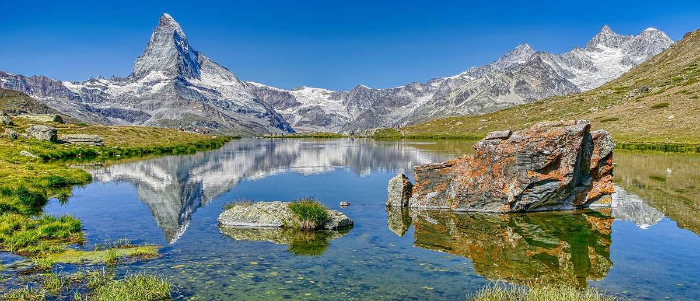
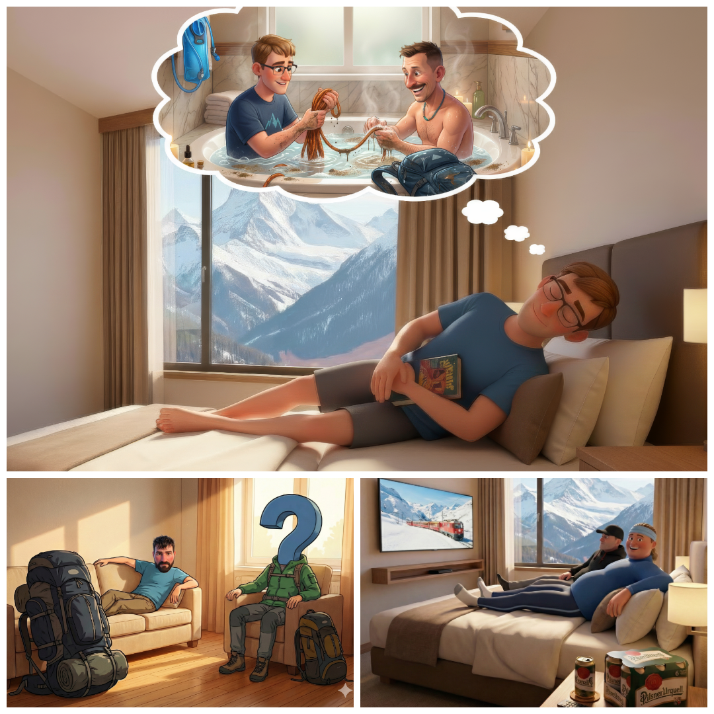
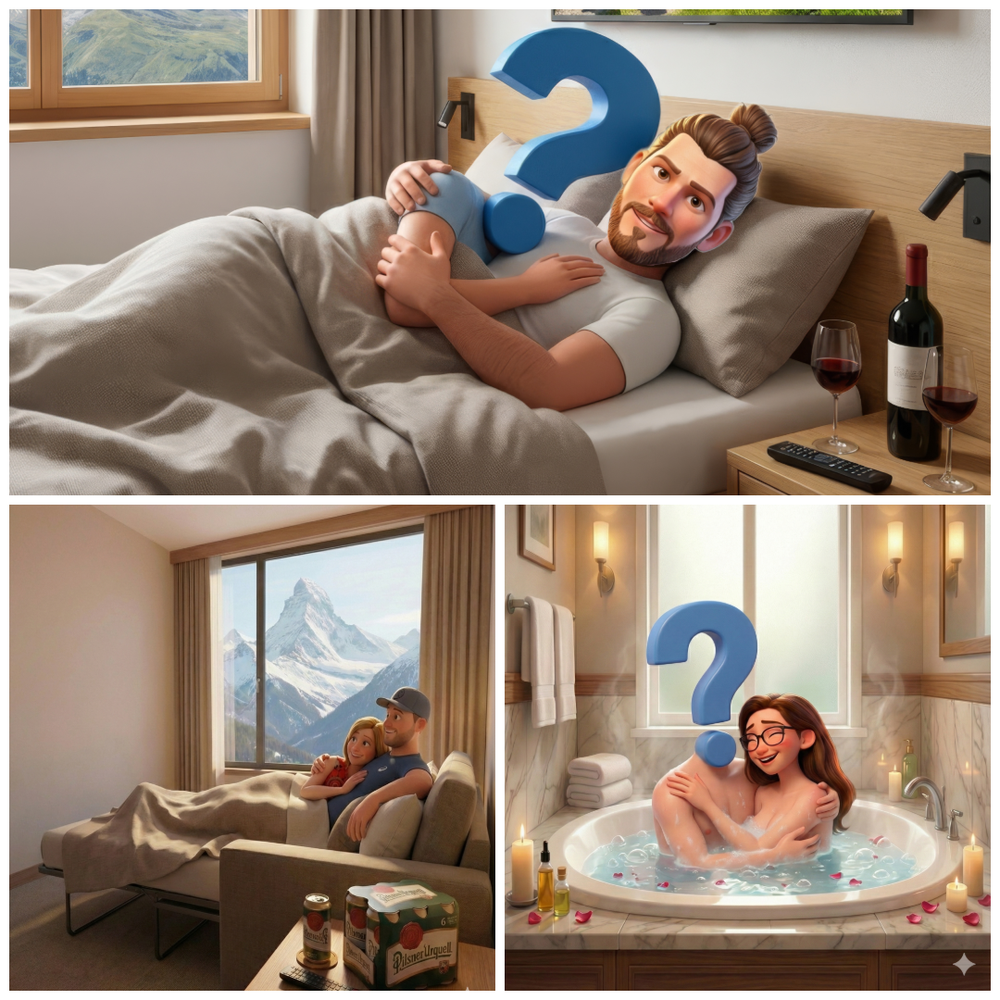

# :calendar: Plánovaná dovolená 2026

{ width="100%" }

---

## :round_pushpin: Destinace

### Švýcarské Alpy, Švýcarsko

Plánujeme výpravu do švýcarských Alp. Základnou bude horský resort Pradas v Brigels.

<iframe src="https://www.google.com/maps/embed?pb=!1m18!1m12!1m3!1d2748.3!2d9.0652!3d46.7703!2m3!1f0!2f0!3f0!3m2!1i1024!2i768!4f13.1!3m3!1m2!1s0x47851f67cb1ca195%3A0x1b2f6a638ee4bec9!2sPradas%20Resort%20Brigels!5e0!3m2!1scs!2scz!4v1234567890123" width="100%" height="450" style="border:0;" allowfullscreen="" loading="lazy" referrerpolicy="no-referrer-when-downgrade"></iframe>

📍 <a href="https://www.google.com/maps/place/Via+Plaun+Rueun+44,+7165+Breil%2FBrigels,+Switzerland/@46.7703,9.0652,17z" target="_blank">Pradas Resort, Via Plaun Rueun 44, 7165 Breil/Brigels</a>

---

## :house: Ubytování

### Pradas Resort

**Adresa:** Via Plaun Rueun 44, 7165 Breil/Brigels, Švýcarsko  
**Kapacita:** 30 osob (5 apartmánů)  
**Termín:** 20. 6. - 27. 6. 2026 (7 nocí)  

#### Apartmány

Máme rezervaci na **5 apartmánů**. Každý apartmán nabízí:

- :white_check_mark: 3 místnosti po 2 lůžkách (kapacita 6 osob na apartmán)
- :white_check_mark: 1 místnost se soukromou koupelnou
- :white_check_mark: 1 místnost s televizí
- :white_check_mark: Plně vybavená kuchyně
- :white_check_mark: Společná terasa s výhledem na Alpy
- :white_check_mark: WiFi
- :white_check_mark: Parkování zdarma
- :white_check_mark: Wellness centrum s bazénem a saunou

{ width="300" data-gallery="apartments" }

{ width="300" data-gallery="apartments" }

{ width="300" data-gallery="apartments" }

{ width="300" data-gallery="apartments" }

{ width="300" data-gallery="apartments" }

!!! info "Rezervace"
    **Stav:** Potvrzeno  
    **Kontakt resort:** +41 81 941 13 31  
    **Web:** [www.pradas.ch](https://www.pradas.ch)

#### Virtuální prohlídka resortu

Podívejte se na 360° fotografie Pradas Resort:

<iframe src="https://www.google.com/maps/embed?pb=!4v1732881234567!6m8!1m7!1sCIHM0ogKEICAgICy1ITOwQE!2m2!1d46.77030780000001!2d9.067500699999999!3f80!4f0!5f0.7820865974627469" width="100%" height="450" style="border:0;" allowfullscreen="" loading="lazy" referrerpolicy="no-referrer-when-downgrade"></iframe>

🏨 <a href="https://www.google.com/maps/place/Pradas+Resort+Brigels/@46.7703646,9.0676362,3a,75y,80h,90t/data=!3m8!1e1!3m6!1sCIHM0ogKEICAgICy1ITOwQE!2e10!3e11!6shttps:%2F%2Flh3.googleusercontent.com%2Fgpms-cs-s%2FAPRy3c_2Gx9GIlHct_DWJXMrUpibE1brIHrGr7uHiZ5fXnfgHK-gBE2M4mfzhzbf-3hBTHBL48xWdlCj4QovJq1OXjqdFZ0_U8aUN_E8_YPT_QRvllkEr49bZh7DUokeUyxoe2dH8SJlMg%3Dw900-h600-k-no-pi0-ya86.7232055664062-ro0-fo100!7i6656!8i3328" target="_blank">Zobrazit 360° fotografie interiéru resortu</a>

---

## Plánované výstupy

!!! abstract "⚠️ Důležité upozornění (Čtěte pozorně!)"
    Následující seznam berte prosím **s lehkou rezervou**. Jedná se spíše o můj "romantický nástřel" než o závazný vojenský rozkaz. Finální logistiku, časový harmonogram a schvalování tras s důvěrou přenechávám našim expedičním expertům:
       
    * **Ficimu** –  aby to celé srovnal do tabulek a dávalo to smysl.
    * **Hanzovi** – aby posoudil, zda jsou vybrané skály dostatečně kolmé a technicky výživné.

    📍 Pro lepší orientaci (a pro ty, co rádi jezdí prstem po mapě) jsem všechny body zanesl do Google Mapy.

### 🥾 Horské túry (bez ferrat)

#### 1. Piz Aul (3121 m)

**Datum:** 21. 6. 2026  
**Obtížnost:** PD  
**Délka:** 7-8 hodin tam i zpět  
**Převýšení:** 1300 m  
**Typ:** Vysokohorská túra s ledovcovými pasážemi

---

#### 2. Piz Mundaun (2064 m)

**Datum:** 22. 6. 2026  
**Obtížnost:** T3  
**Délka:** 5 hodin  
**Typ:** Panoramatická túra s krásnými výhledy

---

#### 3. Crap Masegn (2477 m)

**Datum:** 23. 6. 2026  
**Obtížnost:** T2  
**Délka:** 4-5 hodin  
**Typ:** Rodinná túra přístupná lanovkou z Flims

---

#### 4. Piz Sezner (2309 m)

**Datum:** 24. 6. 2026  
**Obtížnost:** T3  
**Délka:** 5-6 hodin  
**Typ:** Krásná panoramatická túra nad Brigels

---

#### 5. Lag da Pigniu (2236 m)

**Datum:** 25. 6. 2026  
**Obtížnost:** T2  
**Délka:** 4 hodiny  
**Typ:** Túra k horskému jezeru s možností koupání

---

### 🧗 Via ferraty (orientační nástřel možností)

**Odkaz na ferraty v okolí** [Google maps seznam](https://maps.app.goo.gl/yqZNb9eozsXZrACA6)

#### 1. Via ferrata Diavolo
  
**Obtížnost:** B/C  
**Délka:** 2-3 hodiny  
**Typ:** Lehčí ferrata, ale s nádherným okolím a výhledy. Lezení spíše po nakloněných plotnách, popřípadě po řadě kramlí.  
**Odkaz:** [Více na Alpský Vůdce](https://alpskyvudce.cz/ferrata/Via_ferrata_Diavolo)

---

#### 2. Klettersteig Schijen Zwärg Bergseehütte SAC (C) + Krokodil (C)

**Obtížnost:** C  
**Celkový čas / Délka ferraty / Celkové převýšení:** 3-4 hodiny + 5h / 120m + 7,6km  / 80m + 718m
**Typ:** Pohodovka po mensim skalnatem hrebinku pripominajicim krokodyla na vysokohorske plosine obklopene 3 tisicovkama. Vetsinou B, par C useku. Spousta mist na kochani se panoramou. 2 vezicky, nasledovane mustkem na treti vez. Nejvic scary je asi pohled z prvni veze na trasu na druhou vez.
**Odkaz:** [Více na Alpský Vůdce](https://alpskyvudce.cz/ferrata/Klettersteig_Schijen_Zw%C3%A4rg_Bergseeh%C3%BCtte_SAC)
**Odkaz2:** [Více na Alpský Vůdce](https://alpskyvudce.cz/ferrata/Krokodil)

---

#### 3. Klettersteig Jubilaeus Dammahütte

**Obtížnost:** C  
**Celkový čas / Délka ferraty / Celkové převýšení:** 7h / 150m / 1600m
**Odkaz:** [Více na Alpský Vůdce](https://alpskyvudce.cz/ferrata/Klettersteig_Jubilaeus_Dammah%C3%BCtte)

---

#### 4. Klettersteig Adlerhorst Arnisee Piel Flue

**Obtížnost:** C 
**Celkový čas / Délka ferraty / Celkové převýšení:** 2h / 230m / 100m
**Odkaz:** [Více na Alpský Vůdce](https://alpskyvudce.cz/ferrata/Adlerhorst_Arnisee_Klettersteig)

---

#### 5. Hexensteig (Witches climb)

**Obtížnost:** C/D 
**Celkový čas / Délka ferraty / Celkové převýšení:** 4h / 300m / 675m
**Odkaz:** [Více na Alpský Vůdce](https://alpskyvudce.cz/ferrata/Hexensteig_D)

---

#### Další v nejbližším okolí:

**Název:** Via Ferrata Bälmetentor - Bälmeten - C 
**Odkaz:** [Více na Alpský Vůdce](https://alpskyvudce.cz/ferrata/Via_Ferrata_B%C3%A4lmetentor_-_B%C3%A4lmeten)

**Název:** Stäibber Klettersteig - Kröntenhütte - D ?
**Odkaz:** [Více na Alpský Vůdce](https://alpskyvudce.cz/ferrata/St%C3%A4ibber_Klettersteig_-_Kr%C3%B6ntenh%C3%BCtte)

**Název:** Fürenwand Klettersteig - D 
**Odkaz:** [Více na Alpský Vůdce](https://alpskyvudce.cz/ferrata/F%C3%BCrenwand_Klettersteig)

**Název:** Graustock Klettersteig - D
**Odkaz:** [Více na Alpský Vůdce](https://alpskyvudce.cz/ferrata/Graustock_Klettersteig)

**Název:** Brunnistöckli Zittergrat - C/D + Brunnistöckli - B/C 
**Odkaz:** [Více na Alpský Vůdce](https://alpskyvudce.cz/ferrata/Brunnist%C3%B6ckli_Zittergrat)
**Odkaz2:** [Více na Alpský Vůdce](https://alpskyvudce.cz/ferrata/Brunnist%C3%B6ckli_Zittergrat)

**Název:** Rigidalstockwand - C/D + Rigidalstockgrat - C 
**Odkaz:** [Více na Alpský Vůdce](https://alpskyvudce.cz/ferrata/Rigidalstockwand)
**Odkaz2:** [Více na Alpský Vůdce](https://alpskyvudce.cz/ferrata/Rigidalstockgrat)

**Název:** Braunwald - Klettersteig - C 750m 
**Odkaz:** [Více na Alpský Vůdce](https://alpskyvudce.cz/ferrata/Braunwald_-_Klettersteig)

**Název:** Klettersteig Fruttstägä - C/D
**Odkaz:** [Více na Alpský Vůdce](https://alpskyvudce.cz/ferrata/Klettersteig_Fruttst%C3%A4g%C3%A4)

**Název:** Klettersteig Husky-Lodge Muotathal - B/C 1000m 
**Odkaz:** [Více na Alpský Vůdce](https://alpskyvudce.cz/ferrata/Klettersteig_Husky-Lodge_Muotathal)

**Název:** Graustock Klettersteig - D
**Odkaz:** [Více na Alpský Vůdce](https://alpskyvudce.cz/ferrata/Graustock_Klettersteig)

**Název:** Indianer Klettersteig - C Zipline s kladkou ?
**Odkaz:** [Více na Alpský Vůdce](https://alpskyvudce.cz/ferrata/Indianer_Klettersteig)

**Název:** Speer-Kletterweg - B/C 970m
**Odkaz:** [Více na Alpský Vůdce](https://alpskyvudce.cz/ferrata/Speer-Kletterweg)

**Název:** Tälli Klettersteig - B/C 945m
**Odkaz:** [Více na Alpský Vůdce](https://alpskyvudce.cz/ferrata/T%C3%A4lli_Klettersteig)

**Název:** Klettersteig Tierbergli - B/C 700m
**Odkaz:** [Více na Alpský Vůdce](https://alpskyvudce.cz/ferrata/Klettersteig_Tierbergli)

**Název:** Pietro Biasini - B/C 400m
**Odkaz:** [Více na Alpský Vůdce](https://alpskyvudce.cz/ferrata/Biasini)

**Název:** Klettersteig Languard + La Resgia - C/D 370m
**Odkaz:** [Více na Alpský Vůdce](https://alpskyvudce.cz/ferrata/Klettersteig_La_Resgia)

---

## Doprava

Účastníci budou rozděleni do dvou skupin podle dostupnosti aut:

### 🚗 Skupina A - Doprava autem

**Místo odjezdu:** Wolkerova 150/12, 350 02 Cheb, Česko  
**Cíl:** Pradas Resort, Via Plaun Rueun 44, 7165 Breil/Brigels, Švýcarsko  
**Vzdálenost:** cca 700 km  
**Čas jízdy:** 7-8 hodin (včetně přestávek)

**Trasa:** Cheb → Norimberk → Ulm → Zürich → Chur → Breil/Brigels

<iframe src="https://www.google.com/maps/embed?pb=!1m28!1m12!1m3!1d2703242.5!2d10.5!3d48.5!2m3!1f0!2f0!3f0!3m2!1i1024!2i768!4f13.1!4m13!3e0!4m5!1s0x479af3add634e22f%3A0x407285fe8ca32e0!2sWolkerova%20150%2F12%2C%20350%2002%20Cheb!3m2!1d50.0797!2d12.3713!4m5!1s0x47851f67cb1ca195%3A0x1b2f6a638ee4bec9!2sPradas%20Resort%2C%20Via%20Plaun%20Rueun%2044%2C%207165%20Breil%2FBrigels%2C%20Switzerland!3m2!1d46.7703!2d9.0675!5e0!3m2!1scs!2scz!4v1234567890" width="100%" height="450" style="border:0;" allowfullscreen="" loading="lazy" referrerpolicy="no-referrer-when-downgrade"></iframe>

!!! tip "Dálniční poplatky"
    - :flag_cz: Česko - roční známka
    - :flag_de: Německo - bez poplatků
    - :flag_ch: Švýcarsko - roční vigneta (40 CHF / ~1000 Kč)

---

### 🚂 Skupina B - Doprava vlakem

**Místo odjezdu:** Cheb, nádraží  
**Cíl:** Chur, Švýcarsko (nejbližší velké nádraží k resortu)  
**Čas jízdy:** cca 8-9 hodin (s přestupy)

**Trasa:** Cheb → (Norimberk) → Mnichov → Zürich → Chur

!!! info "Vlakové spojení"
    - **Výhoda:** Zaměstnanci Správy železnic mají výrazné slevy
    - **Upozornění:** Je třeba včas podat žádost o FIP
    - **Přestup v Chur:** Skupina A vyzvedne Skupinu B auty (30 km, 30 minut jízdy)
    - **Doporučení:** Rezervovat místa v předstihu přes [ČD](https://www.cd.cz/) a [SBB](https://www.sbb.ch/)

<iframe src="https://www.google.com/maps/embed?pb=!1m28!1m12!1m3!1d2703242.5!2d10.5!3d48.5!2m3!1f0!2f0!3f0!3m2!1i1024!2i768!4f13.1!4m13!3e3!4m5!1s0x479af3add634e22f%3A0x407285fe8ca32e0!2sCheb%20Railway%20Station!3m2!1d50.0797!2d12.3713!4m5!1s0x4784011a017d5777%3A0x91c8e97c06f49e!2sChur%20Railway%20Station%2C%20Switzerland!3m2!1d46.8537!2d9.5297!5e0!3m2!1scs!2scz!4v1234567891" width="100%" height="450" style="border:0;" allowfullscreen="" loading="lazy" referrerpolicy="no-referrer-when-downgrade"></iframe>

**Pickup bod:** Nádraží Chur → Pradas Resort (30 km, 30 min autem)

---

### 📋 Organizace dopravy

!!! success "Koordinace"
    **Skupina A (auta):**
    - Odjezd: 20. 6. 2026 v 6:00 z Chebu
    - Příjezd do resortu: cca 14:00
    
    **Skupina B (vlak):**
    - Odjezd: 20. 6. 2026 ráno z Chebu
    - Příjezd do Chur: cca 15:00
    - Vyzvednutí Skupinou A: 15:30
    - Příjezd do resortu: 16:00

---

## :money_with_wings: Rozpočet

!!! info "Kurz"
    1 CHF = cca 25 Kč (orientační kurz pro výpočet)

| Položka | Cena celkem | Na osobu (30 osob) |
|---------|-------------|--------------------|
| **Ubytování (5 apartmánů, 7 nocí)** | 7000 CHF / 175 000 Kč | 233 CHF / 5833 Kč |
| **Doprava auta (benzín + vignety)** | 1200 CHF / 30 000 Kč | 40 CHF / 1000 Kč |
| **Doprava vlak (pro část skupiny)** | 800 CHF / 20 000 Kč | 27 CHF / 667 Kč |
| **Jídlo a nákupy (7 dní)** | 6000 CHF / 150 000 Kč | 200 CHF / 5000 Kč |
| **Lanovky a vstupné** | 1500 CHF / 37 500 Kč | 50 CHF / 1250 Kč |
| **Rezerva a nepředvídané výdaje** | 1500 CHF / 37 500 Kč | 50 CHF / 1250 Kč |
| **CELKEM** | **18 000 CHF / 450 000 Kč** | **600 CHF / 15 000 Kč** |

!!! warning "Poznámka k rozpočtu"
    - Ceny jsou orientační a mohou se lišit podle aktuálního kurzu CHF/CZK
    - Ubytování ve Švýcarsku je výrazně dražší než v okolních zemích
    - Jídlo: doporučujeme nakoupit základní potraviny v ČR nebo Německu
    - Doprava vlakem - cena závisí na počtu cestujících a slevách ČD/SŽ

---

## :clipboard: Checklist vybavení

### ⛰️ Horolezecké vybavení

- [ ] **Ferratový set** (tlumič pádů + 2 karabiny)
- [ ] **Horolezecká helma**
- [ ] **Sedací úvaz** (lezecký úvaz)
- [ ] **Rukavice** (ferratové nebo pracovní)
- [ ] **Trekingové pevné boty** (kotníkové, s dobrou podrážkou)
- [ ] **Cepín** (pro ledovcové výstupy - Piz Aul)

### 🎒 Oblečení a základní výbava

- [ ] **Batoh 30-50L** (s pláštěnkou nebo pláštěm)
- [ ] **Nepromokavá bunda** (membránová, Gore-Tex apod.)
- [ ] **Teplé oblečení** (termo prádlo, fleece, pufka)
- [ ] **Funkční prádlo** (odvod potu)
- [ ] **Trekingové kalhoty** (ideálně odepínací)
- [ ] **Čepice a buff**
- [ ] **Rezervní oblečení**
- [ ] **Plavky** (wellness v resortu)

### 🔦 Doplňky a technika

- [ ] **Čelovka** (včetně náhradních baterií)
- [ ] **Sluneční brýle** (kategorie 3-4)
- [ ] **Opalovací krém** (SPF 50+)
- [ ] **Trekingové hole** (teleskopické)
- [ ] **Hydrovak nebo láhev** (min. 1,5-2L)
- [ ] **Powerbanka** (min. 10 000 mAh)
- [ ] **Mobil s GPS aplikací** (Mapy.cz, Alpský Vůdce)
- [ ] **Osobní lékárnička** (náplasti, léky, tape)

### 📋 Dokumenty a finance

- [ ] **Občanský průkaz** (platnost min. 6 měsíců)
- [ ] **Evropský průkaz pojištěnce** (EHIC)
- [ ] **Pojistka úrazová/cestovní**
- [ ] **Platební karty** (Mastercard/Visa)
- [ ] **Hotovost v CHF** (doporučeno min. 100-200 CHF)

---

### 🚫 Co raději NEBRAT - celní limity Švýcarsko

!!! danger "Důležité upozornění"
    **Švýcarsko NENÍ v celní unii EU!** I když je ve Schengenu (žádné pasové kontroly), celníci na hranicích provádějí namátkové kontroly dodržování limitů. Při překročení hrozí vysoké pokuty!

#### 🥩 Maso a masné výrobky

**Limit:** **1 kg na osobu**

- ❌ Čerstvé/mražené maso, uzeniny, šunky, slanina, sušené maso
- ❌ Hotové pokrmy s masem (guláš v zavařovačce, masové konzervy)
- ⚠️ **Překročení:** 17 CHF (~450 Kč) za každý další kg + pokuta při neohlášení

#### 🍺 Alkohol

**Limity:**
- Do 18 % obj. (pivo, víno): **5 litrů na osobu**
- Nad 18 % obj. (tvrdý alkohol): **1 litr na osobu**

⚠️ **Nelze sčítat limity** více osob pro jednu lahev!

#### 💰 Celková hodnota zboží

**Limit:** **300 CHF (~7800 Kč) na osobu**

Zahrnuje: potraviny, dárky, nové věci  
Při překročení: platí se švýcarské DPH (MWST) 8,1 %

#### 🚗 Pro řidiče

**ZAKÁZÁNO:**
- ❌ **Radarové detektory** (i vypnuté v kufru!) → vysoká pokuta + zabavení
- ❌ **Varování před radary** v aplikacích (Waze, Google Maps) → VYPNOUT!
- ⚠️ **Dashcam** - právně složitá (ochrana soukromí), lepší sundat

**POVINNÉ:**
- ✅ **Dálniční známka** (vigneta) - 40 CHF na celý rok
  - Fyzická (lepí se) nebo e-vignette (váže se na SPZ)

#### 📦 Další limity

- **Tabák:** 250 cigaret nebo 250 g tabáku (17+ let)
- **Léky:** Množství pro osobní potřebu (~1 měsíc)
- **Nože:** Pozor na vyhazovací nože a čepele nad určitý limit
- **Drony:** Podobná pravidla jako EU, ale nelze v rezervacích

!!! tip "Doporučení"
    - Velký nákup potravin dělejte v ČR nebo Německu
    - Vezměte hlavně trvanlivé potraviny, těstoviny, cereálie
    - Čerstvé maso a uzeniny nakupte až ve Švýcarsku (dražší, ale bez rizika)
    - Vypněte varování radarů v navigaci PŘED vjezdem do Švýcarska

---

## :material-phone: Důležité kontakty

| Účel | Kontakt |
|------|------|
| **Horská záchranná služba** | 1414 (Rega) / 112 |
| **Pradas Resort** | +41 81 941 13 31 |
| **Info centrum Brigels** | +41 81 941 13 77 |
| **Pojišťovna UNIQA** | +420 800 120 120 |

---

## :link: Užitečné odkazy

- [Pradas Resort - oficiální web](https://www.pradas.ch/)
- [Švýcarská horská služba Rega](https://www.rega.ch/)
- [Předpověď počasí - MeteoSwiss](https://www.meteoswiss.admin.ch/)
- [Turistické trasy Graubünden](https://www.graubuenden.ch/)
- [Swiss Alpine Club](https://www.sac-cas.ch/)

---

!!! success "Stav příprav"
    **Hotovo:** ✅ Ubytování rezervováno (5 apartmánů)  
    **Hotovo:** ❌ Doprava domluvena  
    **Do 31.3.2026:** Švýcarská vigneta  
    **Květen 2026:** Kontrola výbavy  
    **Červen 2026:** Finální organizační meeting

:mountain_snow: <strong>Těšíme se na další dobrodružství!</strong> :mountain_snow:

